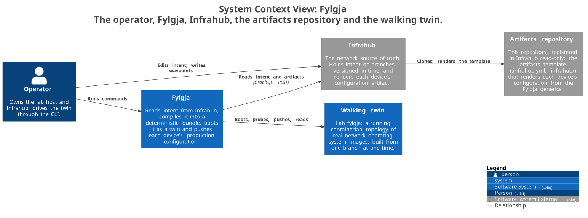
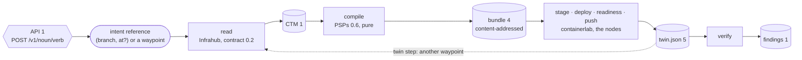
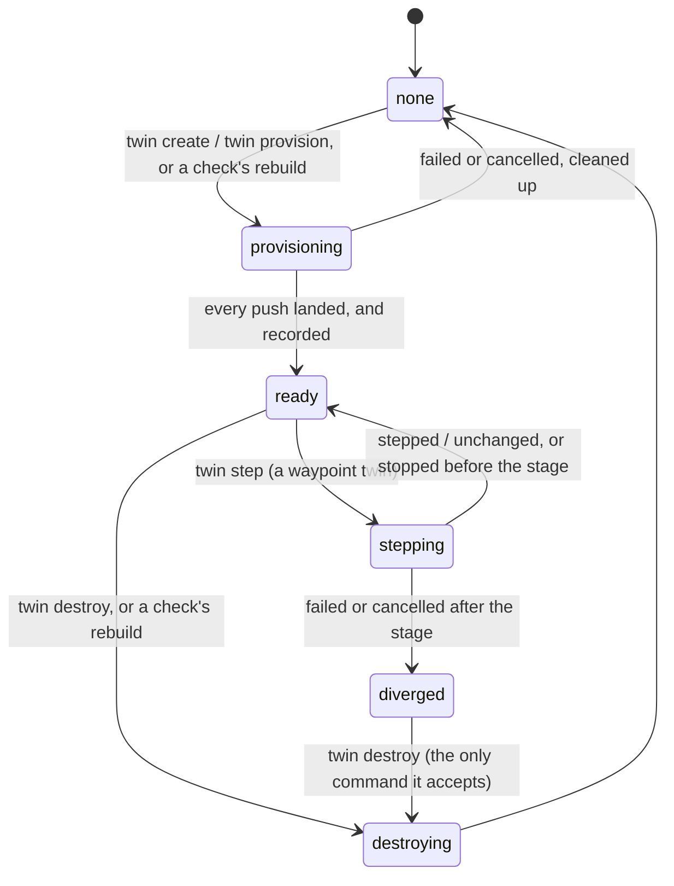
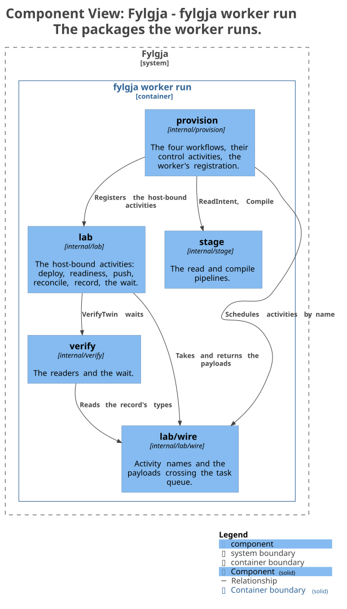
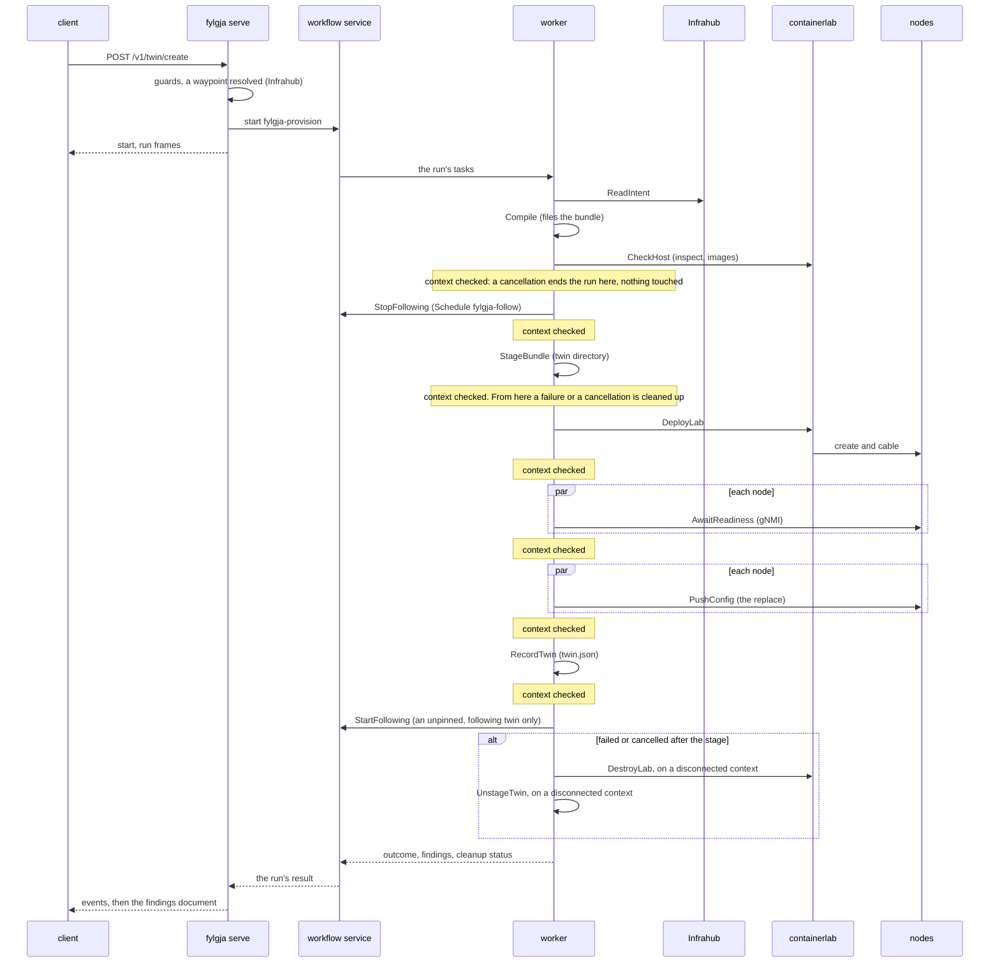
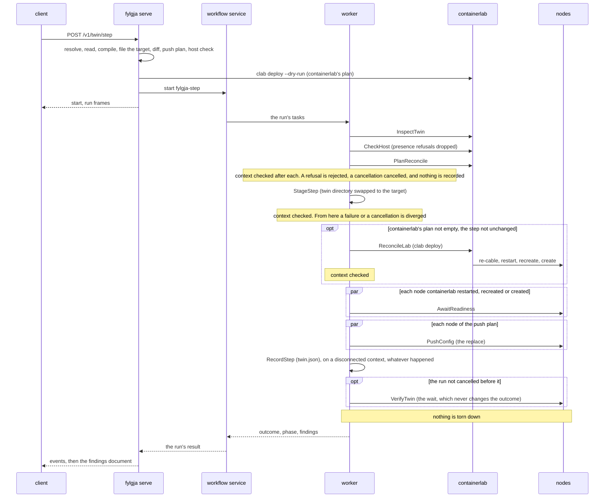
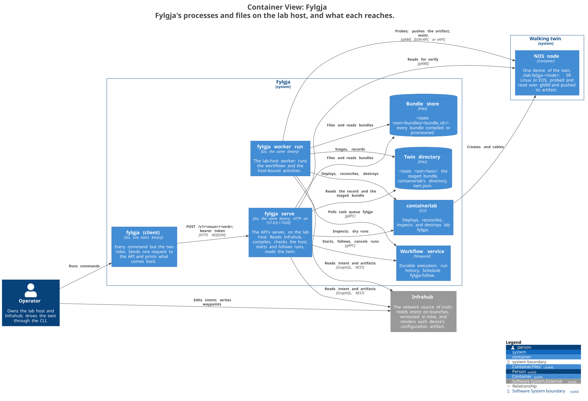
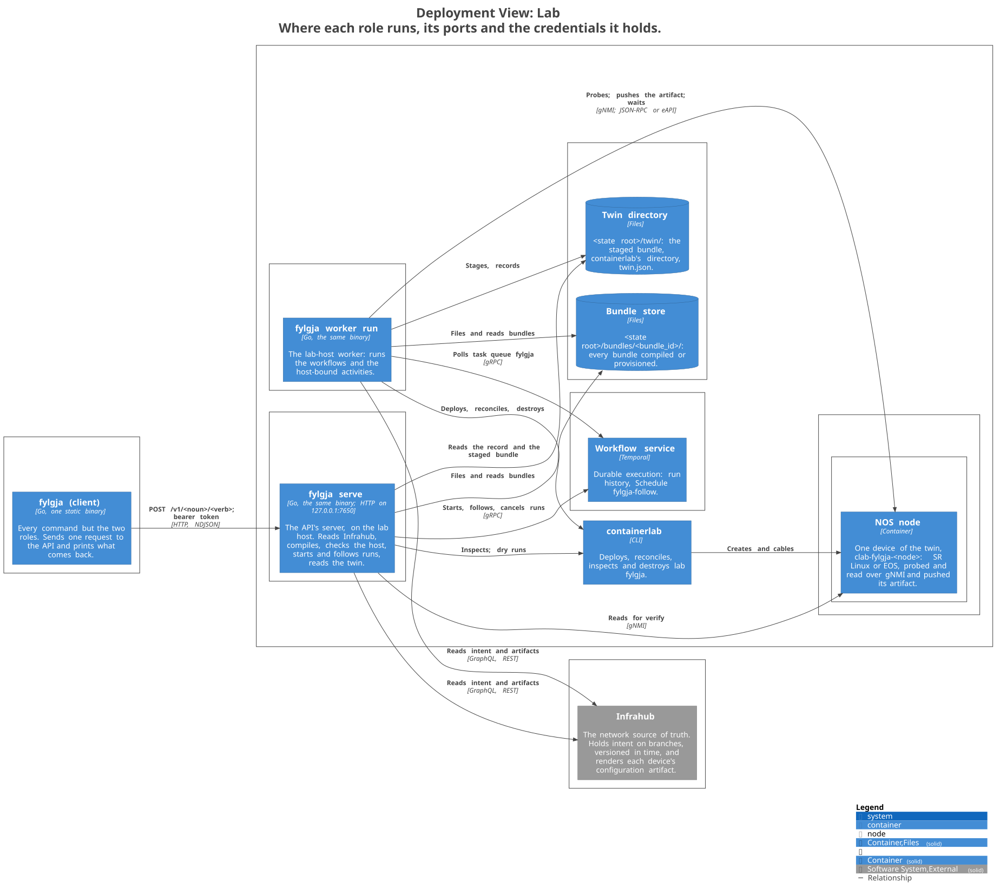
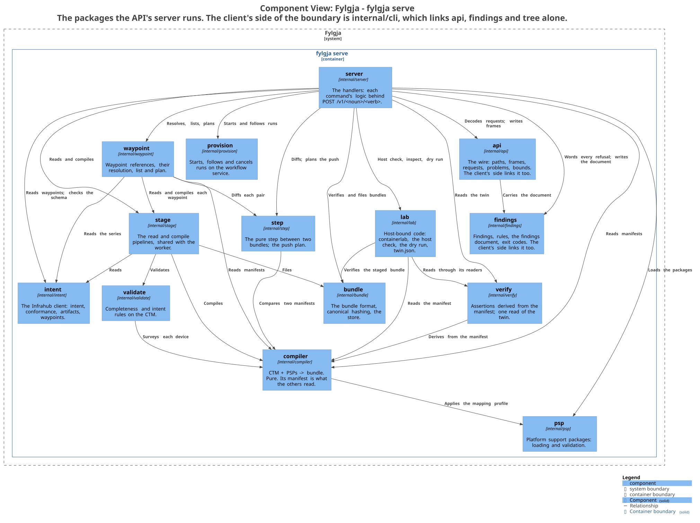

# Fylgja — Architecture

Fylgja reads network intent from [Infrahub](https://opsmill.com/) and builds a
**walking twin** of it: a running virtual topology on real network operating system
images, provisioned with containerlab, built from one Infrahub branch at an optional
point in time. [Temporal](https://temporal.io/) provides durable execution for
provisioning. Fylgja runs one twin at a time.

> Every decision is recorded, with the options it rejected, in the
> [decision log](decisions.md); terms are in the [glossary](glossary.md); conventions in
> the [development guide](development.md).

---

## 1. Claims that shape everything

**The unit of intent is a branch at a point in time.** Infrahub versions the source
of truth itself, so intent has an address: the **intent reference** `(branch, at?)`,
or a **waypoint** that names one. With `at`, a twin is pinned and reproducible bit for
bit. Without it, Fylgja reads the branch head and records when it looked
([D-012](decisions.md#d-012)). A waypoint is a mark the operator writes in Infrahub,
`<series>/<sequence>`, and it always resolves to a pinned `(branch, at)`. Its `at` is
either the one written on it or the moment Infrahub recorded the waypoint's writing, so a
series of waypoints tells a change as a story whose every chapter can be built again
([D-032](decisions.md#d-032)).

**A walking twin is an environment, not a verdict.** The product is the running
topology. Verification, reporting and proposed-change integration are consumers of it,
and nothing in the core acts on them. From M12 `twin verify` reads the running twin
against the intent it was built from and reports what it found, and no Fylgja operation
reads that report ([D-039](decisions.md#d-039)); reporting it on a proposed change is
later. There is one twin at a time, and
its state lives where it already is — in containerlab and on disk — not in a database
of Fylgja's own ([D-013](decisions.md#d-013), [D-014](decisions.md#d-014)).

**A walking twin walks.** A pinned twin is frozen at its instant. A twin built from an
unpinned reference follows its branch: every interval a check reads the branch, compiles
it, and rebuilds the twin when its `bundle_id` has moved
([D-026](decisions.md#d-026)). That is what makes the twin live with respect to intent,
and it is the behaviour the name promises: a fylgja is the spirit that accompanies a
person. `--no-follow` builds a frozen twin instead ([D-027](decisions.md#d-027)).

**Fylgja never renders configuration.** A twin fed by a Fylgja-owned template tests a
different artifact than the one production receives. Per-node bootstrap — hostname,
cabled ports enabled, discovery on — comes from the platform support package;
everything else a node runs is an artifact Infrahub rendered for the branch under test
([D-009](decisions.md#d-009)). Those artifacts enter the bundle at read time, so
`bundle_id` covers configuration ([D-028](decisions.md#d-028)).

**Platforms are data, and any single twin is heterogeneous.** A slice of a real
network spans vendors. Adding a platform is a data change — a Platform Support
Package — never a compiler change, and no component may assume all nodes share a
vendor ([D-016](decisions.md#d-016)).

**Intent is not reality; the control plane is faithful and the hardware data plane is
not.** Infrahub describes what the network *should* be; hardware drifts. Containerized
NOS images run the real routing stack and reproduce no silicon. Every bundle carries a
**fidelity manifest** — modelled exactly, approximated, stubbed, omitted, and
software- versus hardware-forwarding per platform — and every result carries the
unstated precondition "assuming production matches intent"
([D-022](decisions.md#d-022), [§6](#6-known-limitations)). The manifest asserts
forwarding per platform, one entry for each package in the bundle, so a twin of two
vendors states each vendor's answer ([D-025](decisions.md#d-025)).

---

## 2. The pipeline

**Who touches what.** The operator edits intent in Infrahub, writes waypoints there, and
runs Fylgja's commands. Fylgja reads intent and the rendered artifacts from Infrahub over
GraphQL and REST, then boots the walking twin, probes it, pushes each node its artifact
and reads it back. Infrahub renders each artifact from the artifacts template, which it
clones from the artifacts repository: this repository, registered there read-only
([§4.1](#41-intent-reader), [D-044](decisions.md#d-044)).



*The system context, derived from [`c4/workspace.dsl`](c4/workspace.dsl) by `make diagrams`.*

**The stages and their formats.** Every command enters through the API. A twin's
reference is read into a CTM, the CTM is compiled into a bundle, the bundle is provisioned
into a twin and recorded in `twin.json`, and `twin verify` reads the twin against it.
Every command's answer ends in the findings document. Each format carries its version; a
step takes a waypoint twin to another waypoint by the same read and compile, then
reconciles and pushes instead of rebuilding.



| Stage | Input | Output | Pure? |
|---|---|---|---|
| Read | intent reference | CTM, with provenance and each device's configuration artifact; or findings and no CTM | no — reads Infrahub |
| Compile | CTM + PSPs | bundle: deployable topology, bootstrap and configuration artifact per node, manifest | **yes** |
| Provision | bundle | a ready twin on the lab host, each node running its artifact | no — drives containerlab, pushes to the nodes |
| Operate | the twin | show, destroy; reconcile from M4; step from M11, to another waypoint's bundle without a rebuild; verify from M12, which reads the twin against intent and changes nothing | no |

Every stage is runnable on its own from the CLI ([§4.6](#46-operator-surface)), through
the API's server, on the same code path as its tests.

---

## 3. Core objects

```
 intent reference ──read──▶ CTM ──compile──▶ bundle ──provision──▶ walking twin
   (branch, at?)             (envelope:       (manifest:            (lab "fylgja" +
                              branch, at?,     branch, at?,          twin directory:
                              observed_at,     schema_hash,          twin.json adds
                              schema_hash,     contract_v;           observed_at)
                              contract_v)      bundle_id = hash)
```

| Object | Identity | Reproducible from | Lives in |
|---|---|---|---|
| Intent reference | `(branch, at?)` as given, or as a waypoint resolves it | — | CTM and manifest; a waypoint's name only in `twin.json` |
| CTM | its envelope: `(branch, at?, observed_at, schema_hash, contract_version)` | Infrahub, when pinned | bundle store (as JSON) |
| Bundle | `bundle_id`, hash of canonical bytes | its CTM and PSPs, always | bundle store, `bundles/<bundle_id>/` |
| Walking twin | there is one; `fylgja twin show` describes it | never — it is live | containerlab (lab `fylgja`) + the twin directory |
| Lab host | the machine running the worker | — | — |

Rules that follow:

- **A bundle is deployable as emitted.** It carries the fixed lab name and relies on
  containerlab's default management network; nothing host- or twin-specific is added
  after compilation ([D-011](decisions.md#d-011)).
- **The twin is what containerlab says it is.** Its provenance is the manifest staged
  in the twin directory beside it. There is no registry to fall out of sync
  ([D-014](decisions.md#d-014)).
- **Bundles accumulate; twins do not.** The bundle store keeps every compile by hash,
  so the compile-time diff between two references is always available without a
  second twin. From M10, `waypoint plan` prints that diff between each pair of
  consecutive waypoints in a series, and from M11 `twin step` applies it to the running
  twin of a waypoint.

---

## 4. Components

### 4.1 Intent reader

Typed Go generated by `genqlient` from Infrahub's GraphQL SDL
(`GET /schema.graphql?branch=`, fetched from the default branch, because that
branch carries the waypoint kind). Queries go to `POST /graphql/<branch>`, with `at`
appended as a query-string parameter only when the operator supplied one, directly or
through a waypoint.

**Schema contract — Fylgja generics** ([D-002](decisions.md#d-002)). Infrahub's
schema is user-defined, so Fylgja assumes no node kind exists. Fylgja ships a small
set of generics; the organisation's concrete kinds declare they implement them;
Fylgja queries the generic and Infrahub resolves it across every implementing kind.
Three rules: **demand the least possible** (every required attribute is a constraint
on someone else's model); **graduate, don't gate** (optional generics unlock features;
absence produces a recorded skip); **never reach past the generic** (a query against a
concrete kind means the contract is under-specified).

Contract v0.2, shape only (YAML in `schema/`). The generics are v0.1's; v0.2 adds one
demand beside them, that a kind implementing `FylgjaDevice` also inherits Infrahub's
`CoreArtifactTarget`, so its devices can carry a configuration artifact
([D-028](decisions.md#d-028)):

```
FylgjaPlatform                                  # the PSP join key
  vendor     str  required
  nos        str  required
  version    str  optional
  model      str  optional

FylgjaDevice
  name       str  required unique               # becomes the node name
  platform   rel  -> FylgjaPlatform  [1] required
  interfaces rel  -> FylgjaInterface [n]
  role       str  optional
  site       str  optional

FylgjaInterface
  name       str  required                      # production name: ethernet-1/1
  device     rel  -> FylgjaDevice    [1] required
  iftype     str  physical | loopback | svi | subinterface     # kind only
  mgmt_only  bool default false                 # the OOB port; never cabled
  parent     rel  -> FylgjaInterface [1] optional
  enabled    bool default true
  addresses  rel  -> BuiltinIPAddress [n] optional
  link       rel  -> FylgjaLink      [1] optional

FylgjaLink
  endpoints  rel  -> FylgjaInterface [n] exactly 2
```

Naming rule: never claim a name that carries established operational meaning unless
the same meaning is intended. `role` is unclaimed on Interface. The kind discriminator
is `iftype` — IANA's term, and the one Infrahub accepts; it refused `class` and
`type`. `mgmt_only` marks the OOB port and nothing else. Wiring is **derived** from
those two by the compiler, never declared in the schema, and an unimplemented `iftype`
value is an explicit compile-time rejection ([D-003](decisions.md#d-003)).
Structure is reserved only where confidently known: `parent` stays, a VLAN generic
does not ([D-004](decisions.md#d-004)).

**Read validates two things before projecting.** Schema conformance (do concrete
kinds implement the generics on this branch, and inherit `CoreArtifactTarget`? —
`GET /api/schema` and its `used_by`) and data completeness (are required attributes
populated?). Both are checked, all findings are reported in one pass, and a failing
read produces no CTM. `fylgja schema check` runs the conformance half alone.

**The read fetches each device's configuration artifact** ([D-028](decisions.md#d-028)).
The `Devices` query lists the device's artifacts through the `CoreArtifactTarget`
interface, never a concrete kind. The device's support package names the one artifact
that is its configuration and the content types it accepts. The read takes the one
artifact of that name, requires it `Ready`, fetches its bytes from
`GET /api/storage/object/<storage_id>`, and verifies them against Infrahub's own
checksum, the MD5 of the content. A device with no such artifact, with several, with
one not `Ready`, of a type the package does not accept, not served, or whose bytes do
not match is refused, naming the device and the artifact and never a byte of the
content. Fylgja never generates an artifact: that is a write to Infrahub. Infrahub
1.11.2 regenerates nothing on its own either, so whoever changes the branch generates, and a change not yet generated is invisible to the read.

**Time semantics** ([D-012](decisions.md#d-012)). With `at`: passed verbatim on
every query, the artifact listing and the content fetch included; the reference is
pinned, and a pinned read fetches each artifact as it stood at `at` or refuses. Without: no `at` is sent — Infrahub filters on
`created_at <= at`, and pinning a read to a second-granularity local "now" silently
hides objects written that second, a lesson verified against Infrahub 1.11.2.

`observed_at` (UTC, local clock, read start) is recorded on **every** read, pinned or
not, in the CTM file's envelope and, later, in `twin.json` — never in the bundle, so
that the same intent hashes the same whenever it was read
([D-023](decisions.md#d-023), constitution VI). It is informational in every case and
governs nothing when `at` is supplied; on an unpinned read it is the only record of
when the intent was seen, and reproducing that reference via `--at <observed_at>` is
best-effort, which `fylgja twin show` says. The bundle manifest's provenance block records branch,
`at` if supplied, the schema hash Infrahub reports for the branch
(`GET /api/schema/summary`, field `main`), and the Fylgja contract version.

**Waypoints** ([D-032](decisions.md#d-032)). `FylgjaWaypoint`
(`schema/fylgja-waypoint.yaml`) is a Fylgja-owned kind beside the contract, not in it. It
is branch-agnostic, so a waypoint lands in no branch's diff, and it is unique on series
and sequence. The operator writes waypoints; Fylgja only reads them. The reader uses the
default branch's unnamed endpoints and names no branch: `GET /api/schema` first, to check
the kind and its five attributes, then `POST /graphql`. A branch whose schema lacks the
kind cannot query it at all. `--waypoint <series>/<sequence>` is resolved before any run
starts, by the API's server, to the branch the waypoint
names and an `at`. The `at` is the waypoint's `as_of` as written, or, when none is
written, its `branch` attribute's `updated_at` as Infrahub returns it. That stamp moves
only when the waypoint is re-pointed at another branch. The read that follows is the
pinned read above, unchanged, with that `at` verbatim on every query. A refused
resolution (the kind absent, an unknown or duplicated waypoint, a waypoint with no `at`
at all, a given `at` — its `as_of` — later than now, more than six fractional digits)
reads nothing from the branch. The `updated_at` stamp is Infrahub's record of a write
already made, so it is never compared with the resolving process's clock. The waypoint's
name enters neither the CTM nor the bundle. Without the kind, only the three waypoint
surfaces refuse, and `schema check` reports whether the default branch has it.

**Reference schema.** On a greenfield Infrahub the generics alone give nothing to
populate, so Fylgja ships a concrete reference schema implementing them.

### 4.2 Canonical Topology Model (CTM)

The compiler's input: a thin, branch-addressed projection of intent, kept a near-copy
of the generated GraphQL types. Two jobs justify it
([D-010](decisions.md#d-010)): **synthesized nodes** — boundary stubs, service
mocks, later traffic generators are not in Infrahub and cannot live in types generated
from Infrahub — and **insulation** of the compiler from a user-editable schema. Every
object carries **provenance**: `intent`, `observed`, or `synthesized`. Everything is
`intent` today. `fylgja intent read` writes the CTM as JSON. From M5 each device carries
its configuration artifact: name, content type, Infrahub's checksum and the content,
but no Infrahub identifier or generation time, so a regeneration to identical bytes
moves nothing. The artifact reaches the compiler only this way, which keeps it pure.

### 4.3 Compiler

CTM → bundle. **A pure function**: no I/O, no clock, no environment, enforced by a
test ([D-011](decisions.md#d-011)). Purity is what makes the highest-risk logic
in the system — interface mapping — golden-file testable with zero infrastructure.

A bundle is one directory:

| File | Contents |
|---|---|
| `topology.clab.yml` | lab name `fylgja`; every node with platform and image; every cabled link between node ports; containerlab's default management network |
| `configs/<node>.<startup_format>` | bootstrap per node from the PSP: hostname, cabled ports enabled, link-layer discovery on, under the package's comment marker. No addresses, no production configuration. From M7 the package says how it reaches the node — containerlab applies it at deploy, or the push sends its lines ahead of the artifact's ([§4.4](#44-provisioner--temporal)) |
| `configs/<node>.<artifact_name>` | from M5, the node's configuration artifact as Infrahub rendered it, bytes unchanged (`configs/n1.device-config`). Pushed after boot; never rendered or reordered by Fylgja |
| `manifest.json` | bundle format version (`4` from M12, `3` from M7); the provenance block `(branch, at?, schema_hash, contract_version)` — never `observed_at`; platform per node, its `artifact` entry (name, content type, checksum, size, file) and its `bootstrap` entry (the file, and whether it is applied at deploy or pushed); the interface mapping table (production name → node port, the node's own name for the port as `node_name` on every row and `null` on a row with no port, `iftype`, from M12 intent's `enabled`, disposition: cabled / management / configured-not-cabled / omitted); the fidelity manifest, which states that fidelity is asserted, not measured, and carries `production_forwarding` as one entry per platform in the bundle; everything omitted and why; `fidelity.lossy`, every lossy mapping and every shared port with the rule that decided it and the interfaces it shares with |

The bundle is **deterministic** (same CTM and PSPs → byte-identical files, stable
ordering everywhere), **self-describing** (provisioning needs nothing outside the
directory), **deployable as emitted** (no binding step), and therefore
**content-addressed**: `bundle_id` is the hash of its canonical bytes, and a changed
`bundle_id` is the drift signal for reconcile. The artifacts are among those bytes, so a
configuration change moves `bundle_id` as a topology change does. `twin provision`
refuses a bundle of any other format than `4` (`bundle.version.unsupported`, naming both):
a `1` carries no artifacts, a `2` asserts one forwarding value for every node in it and
names no bootstrap entry, and a `3` carries no `enabled`, so `twin verify` would assert a
port intent disables. Every mapping row carries `node_name`, `fidelity.lossy` is always
present, and an empty list is written `[]`; `fidelity.production_forwarding` has one entry
per platform ([D-025](decisions.md#d-025)), and each node a `bootstrap` entry naming its
bootstrap file and how that file reaches the node.

Sub-problems, in the order they kill projects like this:

- **Interface mapping** (M6). Production `Ethernet1/49/1` on a chassis with breakouts
  must become a port on a container with no linecards. The PSP's Interfaces facet is a
  declarative **mapping profile**: an ordered list of named rules, each a `match`
  pattern over the production name with per-placeholder `ranges`, the containerlab
  `port` it renders, the `node_name` the node's operating system calls that port, a
  `lossy` flag checked against the placeholders `port` drops, and optionally a
  `breakout.parent` naming the parent from the child's values. One rule is the
  management rule; it decides the `mgmt_only` interface whatever it is called. The
  first rule whose `match` fits decides, and a value outside a range is out of range
  under that rule, never passed to a later one. One-to-one, one-to-one under another
  name, many-to-one, spreading and collapsing breakout and management are all data.
  The lossy paths are proved by a test-only package with EOS-style naming
  (`testdata/psp/lossy/chassisos.yaml`): cEOS is **not** the lossy case, since it
  carries production's names one to one, so neither shipped platform is lossy
  ([D-021](decisions.md#d-021)).
  - The compiler applies the profile per device in one function that validation calls
    too, so both word every refusal alike, and branches on nothing a package is; a test
    greps its sources for platform names.
  - Interfaces of one device that render one port share it. With one of them cabled
    the others are omitted (`omit.interface.shared`); with none cabled they all keep
    the port; two cabled is `interface.port.collision`. A cabled breakout parent
    beside a cabled child is `interface.breakout.parent_cabled`. A name no rule matches
    is refused (`interface.rule.unmatched`, or `interface.unmappable.linked` when it
    terminates a link); a name matched out of range is omitted when uncabled
    (`omit.interface.unmappable`) and refused when cabled. Every refusal comes in one
    pass with every other, and no bundle is written.
  - Every interface a lossy rule decided and every shared port is recorded in
    `fidelity.lossy`. Bootstrap's `{interface}` renders the node's own name for the
    port. Unmappable interfaces are reported, never dropped.
- **Wiring derivation.** `physical` cables unless `mgmt_only`, in which case it maps
  onto the PSP's management interface name; `loopback`, `svi`, `subinterface` are
  configured, never cabled. A link with a `mgmt_only` endpoint is omitted and
  recorded. `physical` and `loopback` are implemented; the rest are rejected.
- **Image selection.** Platform + version → image reference with a fidelity rating
  (*exact*, *near*, *approximated*, *stub*) from the PSP. A locally imported image is
  supplied through the PSP override directory, not through a bundle parameter.
- **Synthesized nodes.** Added to the CTM before compilation; never looked up by the
  compiler; always in the fidelity manifest.
- **Secrets.** No credential appears in a bundle or a finding. The Infrahub token
  comes from the process environment and is never persisted. A configuration
  artifact's bytes are treated as a secret outside the places they must be: the CTM
  file, the bundle store, the staged bundle and the node. No finding, log line,
  workflow payload, `twin.json` or `twin show` output carries them.

### 4.4 Provisioner — Temporal

Provisioning is long, multi-step, and holds real resources: containers, veth pairs,
host memory. A run that dies at step five of eight must resume, and what it created
must be reclaimed. Temporal supplies durability, retries, heartbeats and history
([D-006](decisions.md#d-006)). Fylgja uses it for exactly that and no more: **short
workflows with fixed IDs** ([D-007](decisions.md#d-007)): `fylgja-provision` and
`fylgja-destroy`, the `reconcile` check, and `fylgja-step`, which waits for the twin to
settle after its record.

**The twin's states.** There is one twin or none, and what a command may do depends on
which state it is in:



`twin create` and `twin provision` start only from `none`, and are refused otherwise,
naming the twin, the lab or the run that holds the host. `twin show` and `twin verify`
answer in every state; with no twin, `verify` refuses as `verify.twin.absent`. `twin step`
starts only from `ready`, and only on a twin built from a waypoint. `twin destroy` takes a
`ready` or `diverged` twin down, and during `provisioning` or `stepping` cancels the run
and waits for its cleanup or its record first. A following twin's check rebuilds it by a
destroy and a provision of its own. `twin show` names the state: a `ready` twin by its kind
(pinned, frozen, following, or from a bundle), a diverged one as kind `diverged`, no twin
as `none`, and a run in flight by its step.

```
 provision  (workflow ID fixed: fylgja-provision)
   ReadIntent ─▶ Compile ─▶ CheckHost ─▶ StopFollowing ─▶ StageBundle ─▶ DeployLab ─▶ AwaitReadiness ─▶ PushConfig ─▶ RecordTwin ─▶ StartFollowing
        (twin provision <bundle-dir> starts at CheckHost, with the stored bundle;
         AwaitReadiness and PushConfig run once per node, concurrently;
         StartFollowing only for a twin that follows its branch)
        on failure or cancellation from StageBundle on: DestroyLab + UnstageTwin on a disconnected context

 destroy    (workflow ID fixed: fylgja-destroy)
   PlanTeardown ─▶ DestroyLab ─▶ UnstageTwin

 reconcile  (M4; a check, started every interval by Schedule fylgja-follow; workflow ID fylgja-reconcile-<scheduled time>)
   InspectTwin ─▶ RunsInFlight ─▶ ReadIntent ─▶ Compile ─▶ compare bundle_id with twin.json's
     ─▶ if changed: CheckHost on the new bundle (presence refusals dropped)
     ─▶ child destroy (fylgja-destroy) ─▶ child provision (fylgja-provision, already compiled)
        on a failed rebuild: StopFollowing on a disconnected context

 step       (M11; workflow ID fixed: fylgja-step; started by twin step with the target read, compiled and filed)
   InspectTwin ─▶ CheckHost on the target (presence refusals dropped) ─▶ PlanReconcile
     ─▶ StageStep ─▶ ReconcileLab ─▶ AwaitReadiness ─▶ PushConfig ─▶ RecordStep ─▶ VerifyTwin
        (ReconcileLab skipped when containerlab's plan is empty or the step is unchanged;
         AwaitReadiness once per node it restarted, recreated or created; PushConfig once
         per node of the push plan, concurrently)
        from StageStep on, on failure or cancellation: RecordStep on a disconnected context,
        the record diverged; nothing is torn down
        VerifyTwin (M12, under GetVersion("verify")): after every record, stepped,
        unchanged or diverged, on the run's own context; skipped when the run was
        cancelled before it; never changes the step's outcome
```

**Inside the worker.** `internal/provision` holds the four workflows, the five control
activities (`ReadIntent`, `Compile`, `RunsInFlight`, `StartFollowing`, `StopFollowing`)
and the worker's registration. It schedules every activity by the name
`internal/lab/wire` gives it, registers the fifteen host-bound activities `internal/lab`
holds, and its `ReadIntent` and `Compile` read and compile through `internal/stage`, on the
server's code path. The host-bound activities take and return wire's payloads, the only
types that cross the task queue, and `VerifyTwin` waits on the twin through
`internal/verify`, which reads the record's types from wire.



*The worker's components, derived from [`c4/workspace.dsl`](c4/workspace.dsl) by `make diagrams`.*

- **Singleton by construction.** The fixed workflow IDs mean a second concurrent
  `provision` is refused, naming the run in flight, and a second `destroy` attaches to
  the one in flight and reports its result. `CheckHost` refuses when lab `fylgja` already
  exists — provisioned or orphaned — and says how to clear it
  ([D-013](decisions.md#d-013)).
- **Cleanup survives everything.** Teardown runs on a disconnected context from every
  failure and cancellation path. There is no sweeper: an orphan lab is detected at
  `create` and at worker start, and `fylgja twin destroy` clears it whether or not a
  twin directory exists. For a step, cleanup is the record, not a teardown: a step that
  fails or is cancelled after its stage leaves the twin up and records it diverged
  ([D-036](decisions.md#d-036)).
- **Activities are idempotent and small.** `DeployLab` checks for the lab before
  deploying; `DestroyLab` tolerates absence; activities pass paths and hashes, never
  bundle bytes — Temporal caps payload size.
- **Slow activities heartbeat.** `DeployLab` and `AwaitReadiness` run for minutes,
  with start-to-close budgets and readiness timeouts from the PSP, never a global
  constant. `PushConfig` heartbeats too, under the package's push budget.
- **Workflow code is deterministic.** No I/O, no `time.Now`, no randomness.
- **One task queue, `fylgja`,** until the host move. Host-bound activities live in
  their own package so the boundary stays visible in code
  ([D-015](decisions.md#d-015)).

**Readiness** ([D-029](decisions.md#d-029)). Each node is probed on its
management plane by the probe its package declares — gNMI, with or without TLS, on the
port and under the encoding the package names. A package may also declare that
readiness waits for the transport its push will use: once the probe answers, the step
opens a connection to `<scheme>://<address>:<port>` and closes it. Only a scheme and a
port cross the wire for that, never a login. cEOS asks for it because its gNMI server
answers a second before its eAPI endpoint does, and on that platform the push is how
bootstrap reaches the node at all; SR Linux does not, because its push transport is up
when its probe answers. Both waits live inside the package's one readiness timeout, and a
transport that never opens fails under `readiness.timeout`, naming which of the two did
not come up.

**The push** ([D-028](decisions.md#d-028), [D-033](decisions.md#d-033)). Once every node is ready, the run pushes each node its
artifact from the staged bundle, all nodes at once. The activity takes the twin
directory, the node's address and the artifact's file and checksum, never the bytes. It
re-verifies the staged file's checksum, then delivers it by the mechanism, commit style
and mode the node's package declares, under the package's `push_timeout_s`. Two
mechanisms are implemented, each keyed by the package's `delivery` value and by nothing
else the package is, and both shipped packages declare `mode: replace`. A **replace**
resets the candidate to the baseline containerlab left on the node, sends the bundle's
bootstrap, then the artifact, asks the device for its diff and commits, in one request
with one atomic commit; the device computes the difference, and Fylgja reads none of the
node's configuration back:

- SR Linux (`json_rpc`): one JSON-RPC `cli` request over HTTPS — `enter candidate
  private`, `load startup`, the bootstrap's lines, the artifact's lines, `diff flat`,
  `commit now`.
- EOS (`eapi`): one eAPI `runCmds` request over HTTPS, `format: text`, in a named
  configuration session — `enable`, `configure session`, `rollback clean-config`, `copy
  startup-config session-config`, the bootstrap's lines, the artifact's lines, `show
  session-config diffs`, `commit` — with the session aborted before the next attempt
  when a line is refused.

At create the node holds only its baseline, so a replace lands what a merge would. A
package on `merge` (the artifact merged over bootstrap) still creates, but cannot step. The device's diff is the push
activity's result and lives in the run's history alone: no record, finding, document or
log line carries it. A replace on `json_rpc` whose refusal is cut before its reason asks
the node once more with `commit validate`, which commits nothing
([D-034](decisions.md#d-034), [D-035](decisions.md#d-035)). The twin is `ready` only
when every push succeeded, and `twin.json` records each node's artifact and how long its
push took. A push the node refuses (`push.refused`, not
retried: the same bytes would be refused again) or one that could not be made
(`push.failed`, three attempts in all where a retry can help) fails the run at step
`push`. It names
every node's outcome, then runs the same cleanup as any failure after the host check. A
cancellation during a push waits for it (`WaitForCancellation`), and a push that
finishes after its run's cancellation still ends the run cancelled. The step was added
under `workflow.GetVersion("push")`, so histories recorded before M5 replay without it.
A rebuild pushes too, inside its provision child, and a refused push there is
`rebuild_failed`, which stops following.

**Following** ([D-007](decisions.md#d-007), [D-026](decisions.md#d-026)). A create without
`--at` or `--no-follow` ends its provisioning run with one more step, `StartFollowing`,
which creates Schedule `fylgja-follow`. The Schedule holds the branch and the interval
and nothing else. It starts a check every interval, one at a time (overlap `SKIP`), and
never replays intervals missed while the service was down. A worker away for hours costs
one pending check, not one per interval. A create or provision stops any following that
exists once its own host check has passed, so a provisioned twin never inherits one and a
refused create leaves following as it was. `twin destroy` deletes the Schedule first, then
cancels a check in flight and waits for its cleanup. Deleting a Schedule does not stop a
check it already started.

A check always completes, with one of seven outcomes:

- **`unchanged`**: the ids are equal, and nothing is touched.
- **`rebuilt`**: the destroy and the provision ended ready. The new `twin.json` names a
  real `fylgja-provision` run and the check's `observed_at`.
- **`rejected`**: the read, the compile, or the host check on the new bundle refused.
  Every refusal a host-free check can make runs before the old twin is destroyed.
- **`error`**: a step before the destroy could not run.
- **`skipped`**: there is nothing to compare against (no twin, an orphan, a twin of
  another branch, a pinned twin or one from a bundle), or an operator's run is in flight.
  A check never provisions a twin where there was none.
- **`rebuild_failed`**: the destroy left something, or the provision did not end ready.
  This outcome **stops following**. The host is as the child's cleanup left it, and
  nothing follows until the operator creates again.
- **`cancelled`**: `twin destroy` cancelled the check. The cancelled child cleans up first
  (`ParentClosePolicy: ABANDON`, `WaitForCancellation`), and following is stopped by that
  destroy.

The children run under the operator's fixed IDs, so a create during a rebuild is refused
as `run.in_flight` and a destroy during one cancels it.

`CheckHost` also sums the PSP memory budgets of the bundle's nodes against the host
budget the operator configured (`FYLGJA_HOST_MEMORY_MB`) and refuses with a reason
rather than failing slowly at boot; with no budget set it reports the sum as a warning
and proceeds. The budget is never derived from the host's free memory.

**How a run ends.** A provisioning run always completes, including when provisioning did
not. It returns an outcome — `ready`; `rejected`, refused before the host was touched
(read or compile findings, the host check, a bundle that fails verification); `failed`,
after it; `cancelled`; or `error`, a step that could not run — together with every
finding and the cleanup's status: teardown and unstage each `done`, `nothing`, `failed`
or `skipped`, and anything that remains. Temporal records the run as completed, and the
outcome becomes the document's status, by which the CLI exits. A destroy run reports the
same cleanup status.

**A create, end to end.** The server makes the command's refusals, resolves a waypoint,
and starts `fylgja-provision`; the worker runs every step. After each step the workflow
looks at its own context, since `CheckHost`, `StopFollowing`,
`StageBundle` and `RecordTwin` do not heartbeat and finish even when the run was cancelled
while they ran. A failure or a cancellation before the stage ends the run with nothing
touched; one from the stage on runs the cleanup:



**Two start options, both silent when missing.** `fylgja-provision` starts with
`WorkflowExecutionErrorWhenAlreadyStarted`: without it the Go SDK swallows the server's
already-started error, and a second `create` would wait on the first run and report that
run's result as its own. `fylgja-destroy` starts with the `USE_EXISTING` conflict policy,
which is what makes a second destroy attach. A destroy that finds a provision in flight
cancels it and waits for its cleanup first. Cleanup waits for a cancelled activity to
stop (`WaitForCancellation`) before tearing anything down. Tier-1 tests pin all three
options; the ordering itself shows only against a live service, because the SDK's test
suite ignores `WaitForCancellation`; each default was seen to misbehave against a live
service. `fylgja-step` starts as `fylgja-provision` does, with
`WorkflowExecutionErrorWhenAlreadyStarted`, pinned by the same kind of test.

**Stepping** ([D-036](decisions.md#d-036)). `twin step` takes a twin built from a
waypoint to another waypoint of its series without a rebuild. The command's request does
everything that touches nothing first, in the API's server: it reads the host, chooses and resolves the target, reads and compiles it on
`waypoint plan`'s code path, files it, computes the step (`step.Diff`) and the push plan,
runs the host check on the target with the presence refusals dropped, and reads
containerlab's plan (`clab deploy --dry-run --format json` on the store's copy of the
target, with `CLAB_LABDIR_BASE` at the twin directory, which reads containerlab's state
there and writes nothing). Every refusal is made there, before any connection to the
workflow service. Then it starts `fylgja-step`, which re-applies the host-bound rules
as second locks and runs:

1. **`inspect`, `host check`, `plan reconcile`**: reads only. A refusal is `rejected`,
   exit 1, and a cancellation is `cancelled`, exit 2; nothing is recorded.
2. **`stage`**: the twin directory's bundle is swapped to the target's. From here the
   host is touched, and every failure or cancellation is **diverged**.
3. **`reconcile`**: `clab deploy` on the target topology, without `--reconfigure`, so
   containerlab applies the change to the running lab: SR Linux re-cables live, a cEOS
   node restarts in place, a node whose image or kind changed is recreated, a new node is
   created. Skipped when the plan is empty or the step is unchanged.
4. **`readiness`**: the readiness probe for every node containerlab restarted, recreated or
   created, all at once, under each node's package's budget.
5. **`push`**: the replace on every node whose artifact or bootstrap changed and every
   node containerlab restarted, recreated or created, all at once. Every push is awaited,
   so the record names each node's outcome.
6. **`record`**: `twin.json`, on a disconnected context,
   whatever happened after the stage.
7. **`observe`** ([D-039](decisions.md#d-039)): the **wait**. `VerifyTwin` reads the
   twin as `twin verify` does, once a second, until every assertion read from a node
   holds (**settled**) or the budget is spent (`expired`, or `incomplete` when a node was
   still unread), and writes how it ended into the record's `step.wait`. The budget runs
   from the record's time: 120s by default, `twin step --wait <duration>` otherwise. It
   runs after every record, a diverged one included, and never waits on the record's
   claims. A `twin destroy` during it cancels it (`cancelled`, recorded), and a run
   cancelled before it skips it. It was added under `workflow.GetVersion("verify")`, so
   M11's step histories replay without it.

A step ends `stepped` or `unchanged` (exit 0), `rejected` (1), `cancelled` before the
stage (2), or `diverged` (4): the twin stays up, the record keeps where it came from and
names where it was going, the phase, and which nodes the push reached, and it accepts only
`twin destroy`. A step whose plan restarts or recreates a node needs `--allow-restart`. No
step tears anything down. **The wait never changes the outcome, exit, status, phase or
timings**: a wait that did not settle adds the warning `verify.wait.unsettled` and nothing
else, and the timings stop at the record. The phases reuse the existing budgets: the
deploy budget for the reconcile, `readiness.timeout_s` for each awaited node,
`push_timeout_s` for each replace; the wait's is the operator's, and its activity is
bounded by it plus 30s.

**A step, end to end.** Before the stage a cancellation ends the run `cancelled` with
nothing recorded; from the stage on, every failure or cancellation is recorded diverged,
and nothing is torn down:



### 4.5 Lab host, containerlab, and the twin directory

The lab host is a machine with Docker, containerlab, the NOS images it needs, one
`fylgja worker run` process and, from M13, one `fylgja serve` process beside it
([D-041](decisions.md#d-041)). The development host is the only lab host until M9
([D-020](decisions.md#d-020)). Fylgja **drives the `clab` CLI with structured
output and does not link containerlab** ([D-008](decisions.md#d-008)).

State lives in containerlab, in two directories under the state root, and in Temporal,
and nowhere else. There is no database ([D-014](decisions.md#d-014),
[D-026](decisions.md#d-026)):

**What runs, and what each part reaches.** The operator runs the client, `fylgja`, whose
every command is one request to `fylgja serve`: `POST /v1/<noun>/<verb>` over HTTP with
the bearer token, answered in NDJSON frames. The server reads intent and artifacts from
Infrahub (GraphQL, REST); starts, follows and cancels runs on the workflow service
(gRPC); files bundles in the bundle store and reads them back; reads the record and the
staged bundle in the twin directory; asks containerlab to inspect the lab and for its dry
runs; and reads the nodes over gNMI for `twin verify`. The worker polls the workflow
service's task queue `fylgja` (gRPC); reads intent and artifacts from Infrahub; files and
reads bundles in the store; stages and records in the twin directory; has containerlab
deploy, reconcile and destroy lab `fylgja`; and probes each node over gNMI, pushes it its
artifact over JSON-RPC or eAPI, and waits on it after a step. containerlab creates the
nodes and cables them. The operator also edits intent in Infrahub and writes waypoints
there.



*Fylgja's containers, derived from [`c4/workspace.dsl`](c4/workspace.dsl) by `make diagrams`.*

| | Holds | Read by |
|---|---|---|
| containerlab | whether lab `fylgja` exists, its nodes, their state | `fylgja twin show`, `CheckHost`, `twin verify` |
| the twin directory (`<state root>/twin/`) | the staged bundle, containerlab's working directory, and `twin.json` | `fylgja twin show`, `reconcile`, `twin step` (and containerlab's dry run, for its own state), `twin verify` and the step's wait |
| the bundle store (`<state root>/bundles/<bundle_id>/`) | every bundle ever compiled or provisioned | `fylgja twin provision`, diffing |
| Temporal | run history; Schedule `fylgja-follow` (the followed branch and the interval) | the Temporal UI, `fylgja twin show` (following, the last check, runs in flight) |

No database. The bundle store is a directory behind a small interface so that object
storage can replace it at M8.

Both directories live under one **state root**: `FYLGJA_STATE_ROOT`, by default `local/`
under the working directory, resolved to an absolute path once at start. The worker
prints its root, and from M13 so does the server, so two roles started from different
directories are visibly apart rather than silently looking at different stores. A client
has no state root: it reads no store and no twin directory of its own.

```
<state root>/
├── bundles/
│   ├── <bundle_id>/            a bundle exactly as compiled; hashes to <bundle_id>
│   └── <bundle_id>.ctm.json    the CTM a create, its dry run or a waypoint plan read, beside its bundle, outside the hashed bytes
└── twin/                       present exactly while a twin is provisioned or being provisioned
    ├── bundle/                 a copy of the stored bundle, verified to hash to its bundle_id before deploy;
    │                           a step swaps it for the target's (through .bundle.next and .bundle.prev)
    ├── clab-fylgja/            containerlab's working directory, placed here with CLAB_LABDIR_BASE; root-owned;
    │                           its .state.clab.yaml is what containerlab's plan for a step reads
    └── twin.json               written last (version 5): provenance, observed_at (or why it is
                                unknown), bundle_id, the run, the worker's version, the waypoint
                                it was built from (or null), each node's address, its artifact
                                (name, content type, checksum, size; never the bytes), how long
                                its push took and the bundle it holds; the state (ready or
                                diverged), the last step (or null) and the step's wait (or null
                                until it ran)
```

**Where each role runs.** The client runs on the operator's machine with
`FYLGJA_API_TOKEN`, and reaches the server at `FYLGJA_API_ADDRESS` or through an SSH
tunnel to the lab host. The lab host (Ubuntu, Docker, containerlab and the NOS images) runs three
processes: `fylgja serve` on `127.0.0.1:7650`, holding the API's token, Infrahub's token
and both node logins; `fylgja worker run`, holding Infrahub's token and both node logins
and no API token; and the workflow service, Temporal's development server (`temporal
server start-dev`) on `:7233`, its UI on `:8233`. The state root (`FYLGJA_STATE_ROOT`)
holds `bundles/` and `twin/`, and containerlab runs as a command. Docker runs lab
`fylgja`'s privileged containers, `clab-fylgja-<node>`, each with gNMI on `:57400` over
TLS (SR Linux) or on `:6030` in plaintext (EOS), and JSON-RPC or eAPI on `:443`. Infrahub
runs under Docker Compose on `:8000`, on the lab host or another machine.



*The deployment, derived from [`c4/workspace.dsl`](c4/workspace.dsl) by `make diagrams`.*

The `<bundle_id>.ctm.json` beside a bundle holds the artifacts' content, as the bundle
does; `twin.json` names them and holds none. Stage creates `twin/bundle/`; deploy adds
`clab-fylgja/`; the push reads the staged artifacts; record writes `twin.json`.
Teardown (`clab destroy --cleanup`) leaves nothing root-owned behind, so unstage removes
the directory whole without privileges. A twin directory present in any state is a host
check refusal, except to a step's host check, which drops the two presence refusals
because the twin is there by design.

**A step moves the record** ([D-014](decisions.md#d-014)). Its stage swaps
`twin/bundle/` for the target's, so after a stepped or unchanged step the staged manifest
and `twin.json`'s top level (`bundle_id`, provenance, `observed_at`, waypoint) are the
target's, and `run` is still the create's. After a diverged step the top level stays the
previous record's, the `step` block names the target, the run and the phase, and each
node's `holds` says which bundle it is last known to run: the target's where its push
landed, `null` for a node containerlab restarted, recreated or created whose push did not
land, and the previous everywhere else. That is not a claim that a push which did not
land left the node untouched. Only `refused` is the node's own answer, and a refused
replace is atomic. A `failed` push (no answer within the budget, a lost heartbeat, a
cancellation) may have committed, as a replace that darkens a node does. So a later
rollback reads each node's `step.pushed[].outcome` beside its `holds`; none is built. A
`3` record reads as a ready twin that has not stepped.

**The record says how the step's wait ended** ([D-014](decisions.md#d-014)).
`twin.json` `5`'s step block carries `wait`: its outcome, budget, reads, `after_s` (seconds
from the record to the end of the read that settled, or of the last read), when it began
and ended, and the assertions still failing, or `null` until `VerifyTwin` writes it. The
activity writes it only when the record's step names its own run, and leaves the rest of
the record as `RecordStep` wrote it. A `4` record reads with its wait unknown.

**What `twin verify` reads** ([D-038](decisions.md#d-038)). It reads containerlab, the
record and the staged manifest, and writes nothing. Its assertions are derived from the
manifest, whose mapping rows carry intent's `enabled` from bundle `4`: a port intent
disables is still cabled and still enabled by bootstrap, since intent's disabling reaches
the node through the artifact, so verify skips that port and its link and records the
skip rather than asserting either. A node's address is the record's, else containerlab's.
What the record says each node holds is reported as the record's claim, never as a read.
A `3` manifest staged under a twin built before M12 reads with every row enabled.

Image acquisition varies by vendor — public registry, account-gated download plus
`docker import`, licensed, VM-based via vrnetlab — and the PSP records the method
alongside the image. SR Linux is first because its image is public
([D-021](decisions.md#d-021)).

**That method has a run-time meaning.** `public_registry` means the deploy may pull,
under the deploy budget. Any other value says
the image cannot be fetched, so the host check asks the host whether it is there
(`docker image inspect`, once per distinct reference) and refuses the run before
anything is staged when it is not — `host.image.absent`, a rejection naming the
reference, the package, the nodes that need it, how the image is obtained and that
Fylgja will never pull or tag it. **Nothing is ever pulled or tagged on the operator's
behalf**: an imported image is the operator's to place, under exactly the reference the
package names, and the same image under another tag is absent. The worker says at start
whether each such image is present and serves either way, so the state is visible before
a create rather than at the deploy. A bundle whose packages all say `public_registry`
makes no call at all.

### 4.6 Operator surface

CLI first, noun-verb, every stage exposed ([D-019](decisions.md#d-019)). The CLI is a
client of the API, and the API is the boundary of the core
([D-040](decisions.md#d-040), Constitution XI):

```
fylgja serve         [--listen <host:port>] [--psp-dir <dir>]
                                                  # the API's server, on the lab host beside the worker; serves
                                                  #   every command below but worker run
fylgja twin create   --branch <b> [--at <ts>] [--no-follow] [--interval <d>]
                                                  # all stages; refused while a twin exists; follows unless --at or --no-follow
fylgja twin create   --waypoint <series>/<sequence>
                                                  # the same run, pinned to what the waypoint resolves to; never follows
fylgja twin step     [--waypoint <series>/<sequence>] [--allow-restart] [--wait <duration>] [--dry-run]
                                                  # a waypoint twin to another waypoint of its series (the next by
                                                  #   default) without a rebuild; --allow-restart when containerlab
                                                  #   would restart or recreate a node; --wait bounds the wait for
                                                  #   the twin to settle after the record (2m0s by default; 0 reads
                                                  #   once); --dry-run changes nothing
fylgja twin verify   [--wait[=<duration>]]        # reads the twin against intent: host names, cabled ports,
                                                  #   adjacencies, and the record's claim of what each node holds;
                                                  #   --wait reads again until it conforms (2m0s bare); no run, no
                                                  #   worker; changes nothing; exit 5 when it does not conform
fylgja twin show                                  # the host, twin.json, the kind (pinned, frozen, from a bundle,
                                                  #   following, diverged), the waypoint a twin was built from and
                                                  #   the step that brought it there with how its wait ended, each
                                                  #   node's artifact, the last and next check, runs in flight;
                                                  #   changes nothing
fylgja twin destroy                               # stops following first, cancels a step and waits for its record,
                                                  #   then removes the twin

fylgja intent read   --branch <b> [--at <ts>] --out ctm.json
fylgja intent read   --waypoint <series>/<sequence> --out ctm.json
fylgja twin compile  --ctm ctm.json --out <bundle-dir>   # the pure function, same code path as the golden tests
fylgja twin provision <bundle-dir>                # starts the provision workflow from an existing bundle

fylgja waypoint list [--series <s>]               # every waypoint and what it resolves to; marks the twin's row,
                                                  #   and where a diverged twin was going
fylgja waypoint plan --series <s>                 # reads and compiles each waypoint; the step between each pair

fylgja schema check  --branch <b>                 # also says whether the default branch has the waypoint kind
fylgja psp validate  <file>...
fylgja worker run    [--psp-dir <dir>]
```

**Where each command runs.** One binary carries three roles
([D-018](decisions.md#d-018)). `fylgja serve` and `fylgja worker run` run on the lab
host, each a process of its own, from one state root and one environment, to which the
server adds the API's token ([D-041](decisions.md#d-041)). Every other command above is
a **client's command**: one request to the server, `POST /v1/<noun>/<verb>`, which
prints what comes back and exits by the document's status. A client's whole
environment is `FYLGJA_API_ADDRESS` (default `127.0.0.1:7650`) and `FYLGJA_API_TOKEN`
([D-042](decisions.md#d-042)). It reads no Infrahub variable, no login, no state root and
no package directory, and `--psp-dir` is a flag of the two roles alone. The package that
holds the client's commands, `internal/cli`, links `internal/api`, `internal/findings`
and `internal/tree` and nothing else of the module, and
`TestClientReachesTheCoreThroughTheAPIAlone` holds it so. So no flag or variable can make
a client run the core.

- **The server does the work.** Each handler holds a command's logic: the guards, the
  waypoint's resolution, the read and the compile, the filing, the host check,
  containerlab's dry run, the start, the follow and the closing report. Every refusal is
  the server's, and one made "before any connection" is made before the server connects
  to Infrahub or the workflow service. The server reads containerlab, the twin directory, the bundle
  store and the nodes in its own process, not through the task queue, until M9 moves the
  host. It loads the packages, dials the workflow service and reads Infrahub per request,
  and keeps nothing between two requests.

  **Inside the server.** The handlers, `internal/server`, decode each request and write
  each frame through `internal/api`, which carries the document `internal/findings`
  defines; they word every refusal and write that document through `findings`, and load
  the packages through `internal/psp`. A read and a compile
  go through `internal/stage`, which reads with `internal/intent`, validates with
  `internal/validate`, compiles with `internal/compiler` and files with `internal/bundle`.
  `internal/waypoint` resolves, lists and plans: it reads the series with `intent`, reads
  and compiles each waypoint through `stage`, diffs each pair with `internal/step` and
  reads manifests from `compiler`. The handlers also read waypoints and check the schema
  with `intent`, diff a step and plan its push with `step`, verify and file a sent bundle
  with `bundle`, read manifests from `compiler`, check the host, inspect the lab and run
  containerlab's dry run with `internal/lab`, read the twin with `internal/verify`, and
  start and follow runs with `internal/provision`'s client. `lab` verifies the staged
  bundle with `bundle`, reads the manifest from `compiler` and reads the nodes through
  `verify`'s readers; `verify` derives its assertions from the manifest, `validate`
  surveys each device as the compiler does, `step` compares two manifests, and the
  compiler applies each package's mapping profile from `psp`. Every arrow in the view
  below is an import. `findings` and `psp`, which nearly every package imports, are drawn
  from the handlers, the API and the compiler alone, and `provision`'s own imports serve
  the workflows the worker runs; the [development guide](development.md#repository-layout)'s
  import graph has every edge. On the client's side of the boundary, `internal/cli` links
  `api`, `findings` and `tree` and nothing else.

  

  *The server's components, derived from [`c4/workspace.dsl`](c4/workspace.dsl) by `make diagrams`.*
- **An answer is frames**: one JSON object a line (`application/x-ndjson`), the last
  always the findings document. With nothing asked, a command that is one answer is the
  document alone, after the `files` frame that `intent read` and `twin compile` send
  first; a run is its `start`, its `run`, its `event`s and its document, and `twin
  destroy` its `start`, its `event`s and its document, with no `run`. The CLI asks the
  server to render the text as well, and prints each line as it arrives. A command that
  ran is a success of the transport, whatever it decided. The transport's own statuses are
  for its own faults: `401` for the token, `404` for a version, a stream, a path under
  `/v1/` that names no operation or is asked with another method than `POST`, a path not
  in its clean form (`//v1/twin/show`) or `/v1` without its slash, never a redirect, `413`
  for the bound, `400` for a request the server cannot read, `409` for a stream already
  open.
- **A run is two requests.** A create, a provision or a step is one request that starts
  the run and stays open as its progress: a `start` frame, the run's identity, its events
  and its document. The operator's interrupt is the second request,
  `POST /v1/streams/{stream}/interrupt`, delivered to the open one. The first abandons a
  start still waiting for a worker or cancels the run, and the second stops waiting.
  While that request is open, the server holds the channel its interrupts arrive on, and
  nothing else ([D-014](decisions.md#d-014)). A client that goes
  away, or a server that stops, leaves the run running, a start still waiting for a worker
  included. The client then says the API stopped answering and that the run was not
  cancelled, or was asked to cancel once an interrupt had been delivered, and `twin show`
  names the run.
  `twin destroy` is followed the same way and takes no interrupt: its `start`, written
  just before the destroy run is started, opens no stream.
- **The stage commands need a server.** `psp validate` and `twin compile` still need
  neither Infrahub nor the workflow service, but the server checks and compiles what the
  client sends it, against the server's packages ([D-019](decisions.md#d-019)).
  The operator's files cross whole, as base64, under a 32 MiB bound. `intent read --out`
  and `twin compile --out` write what comes back to the operator's own disk. `twin
  provision <bundle-dir>` sends the directory's regular files, which the server verifies
  and files in its store. `psp validate` sends each package. A dry run or a plan files
  its bundle in the store on the lab host, and nothing fetches it back.
- **A client has failures of its own**: `api.unreachable`, `api.token.refused` and
  `api.version.unknown` between it and the server, and `api.transfer.too_large` for a
  request over the server's bound or a frame of the answer over the client's. Each is status `error`, exit 2, with no step. A client whose
  build differs from the server's says so in one line on stderr and goes on.

`twin show` runs in the server's process on the lab host: containerlab and `twin.json` as
the host check reads them, then the workflow service, best-effort under a five-second
budget. With the service unreachable it still reports the host and the record, says
following and runs in flight are unknown, and exits 0.

`waypoint list` and `waypoint plan` run in the server too, and need no lab, worker or
workflow service. The plan reads and compiles each waypoint of a series on the code path
`twin create` uses, files each bundle in the store, and prints each `bundle_id`. Between
each consecutive pair it prints the **step**: the nodes, links, bootstraps and artifacts
that differ, by presence and checksum, with `provenance` left out of the comparison. So
two waypoints of an unchanged branch read `unchanged`, although their ids always differ
([D-032](decisions.md#d-032)). The step is a pure function of the two bundles
(`internal/step`), and from M11 `twin step` applies it to a running twin.

`twin step` prints the twin it starts from, the target's waypoint line, the step, then
containerlab's plan with each touched node's package declaration beside it (`reconcile:
restart e1 (added link; arista_eos declares restart); live s1 (added link; nokia_srlinux
declares live)`, or `nothing to apply`) and the push plan with each node's reasons. Its
dry run prints the same lines, the host check's `memory:` and `host:` lines and a verdict,
and changes no lab, container, twin directory or run; like every dry run it files the
target's bundle and CTM. Every refusal it can make, it makes before any connection to the
workflow service. `twin show` keeps the kind `pinned` for a stepped twin and names the
step on its kind line and in its record block (`stepped from demo/1 by run fylgja-step …;
reconcile 3.9s (restart e1); readiness e1 54.8s; push e1 1.6s, s1 2.4s`). A diverged twin
is the kind `diverged`, in one line: where it was going, the run, the phase, the nodes
landed and not landed, where it is, and `fylgja twin destroy clears it`. A step in flight
is named on the kind line, as a rebuild in flight is. From M12 the step line ends with how
its wait ended (`; settled after 2.4s`, `; wait expired after 120.0s (3 failing)`, `; wait
not run`), and a step at `observe` is listed under `in flight:` alone, since its record
is already written. `twin step` prints `step observe: settled after 2.4s (1 read)` after
`step record:`, and its closing line ends with the same clause; the dry run prints the
budget (`wait: after the record, until the twin conforms, at most 2m0s`).

`twin verify` ([D-037](decisions.md#d-037)–[D-039](decisions.md#d-039)) runs in the
server's process on the lab host, as `twin show` does, with no run and no worker. It reads
the twin, asks the workflow service best-effort for runs in flight, refuses before any
node is read when there is no twin (`verify.twin.absent`, in the host check's phrase), when a
package cannot be read (`host.psp.missing`, `verify.package.unreadable`) or when a probe
login is unset, then derives its assertions from the staged manifest and reads each path
once, over each node's own package's transport. It reports one finding per failed
assertion and per record claim not held, counts the held ones and names the skips. It
ends `ok` (0), `nonconforming` (5) when every node was read and something failed, or
`operation.failed` (2) when a node could not be read. A diverged twin is verified against
its staged bundle, the target, with its divergence on the first line. `--wait` reads
again every second until every assertion read from a node holds or the budget expires.
Nothing acts on the report: no command, check or step reads it.

The API exposes what the CLI needs and nothing more: no re-attach to a run, no listing
of runs, no fetch of a filed bundle. A UI is item 21 of the roadmap's
[order after the launch](roadmap.md#the-order-after-the-launch), and a second client of the same API. Infrahub
proposed-change integration is a later consumer of the twin, not part of the core: items
7 to 9 there.

### 4.7 Platform Support Packages

A **PSP** is the declarative bundle that makes one platform supported
([D-016](decisions.md#d-016)). The format is `0.6`, and [`psp/README.md`](../psp/README.md)
documents each field:

| Facet | Contents |
|---|---|
| Identity | vendor, platform family, OS versions covered (the boot half checks the version a node reports against them) |
| Image | containerlab node kind, image reference, acquisition method (read at run time by the host check, [§4.5](#45-lab-host-containerlab-and-the-twin-directory)), memory budget, deploy and destroy budgets |
| Interfaces | the mapping profile ([§4.3](#43-compiler)): ordered named rules (`match`, per-placeholder `ranges`, `port`, `node_name`, a checked `lossy`, optional `breakout.parent`) and exactly one management rule; and the declared mappings, one per kind the profile handles, that the conformance suite holds it to |
| Config | bootstrap template and the `comment_prefix` its generated header is written under; how a deploy delivers the bootstrap (`bootstrap_via`: `startup_config`, containerlab applies it, or `push`, its lines go ahead of the artifact's; under `mode: replace` the push sends it after the reset either way); the artifact that is a device's configuration (`artifact_name`, `artifact_content_types`); how it is pushed after boot (`delivery`, `commit`, `mode`, `push_timeout_s`, and `push`: scheme, port and the names of the login's environment variables). `mode` is `replace`, [D-033](decisions.md#d-033)'s reset to the node's baseline for the delivery, then the bootstrap and the artifact, in one atomic commit, which both shipped packages declare; or `merge`, which creates but cannot step |
| State | collection transport and model mapping (later verification work) |
| Readiness | how to tell the node answers on its management plane: probe, path, encoding, port, `tls` (`false` is plaintext gRPC, which cEOS serves), the names of the login's environment variables; timeout; and `await_push_transport`, whether readiness also waits for the push's endpoint to accept a connection ([D-029](decisions.md#d-029)) |
| Conformance | optional: what the suite's boot half, `twin verify` and the step's wait read over the readiness probe's transport, and the values it expects: the host name and version paths, and per cabled port the admin state, the discovery state and the neighbour list with the leaves naming the far node and port, the port given by its node name. A neighbour leaf may be a path relative to one neighbour entry, and a checked value may declare what the node means by reporting nothing at all (`absent`), since OpenConfig reports no default. Never reaches a bundle |
| Capabilities | what this container can and cannot do relative to hardware |
| Fidelity | declared approximations; software- or hardware-forwarding; `link_change`, required: what containerlab's reconcile does to a node of the kind when a link of its is added or removed, `restart` (restarted in place, its push lost) or `live` (re-cabled, its push kept). Asserted by the package, measured by containerlab's plan at each step, both recorded, and a difference warned (`step.restart.undeclared`); the step acts on containerlab's plan |

Readiness, the budgets and the probe login are consumed from the worker's own packages
at provision time, looked up by each node's manifest `psp.id`, and never reach the
bundle, so a package change that moves a timeout does not move `bundle_id` (a
node whose package is not on the worker is a host check refusal). The Config
facet's push fields are consumed the same way, on the worker at provision time: a
change to the mode or the push budget moves no `bundle_id`, and neither does
`fidelity.link_change`, which travels on the wire beside them. Its artifact name and
content types are consumed by the read, wherever it runs, and a change to the name
moves `bundle_id` on the next read, because the name is in the bundle and selects the
bytes. A package whose
`delivery` names a mechanism this build does not push by is refused at load
(`psp.config.delivery.unimplemented`, naming the ones there are), never skipped at push
time; `json_rpc` and `eapi` are the two implemented.

**A mechanism is code keyed by a format value; a platform is data**
([D-031](decisions.md#d-031)). The driver implements a fixed, named set of ways to reach
a node — two push mechanisms, each with its reset under `mode: replace`, a probe that
dials with TLS or without, a bootstrap that is applied at deploy or sent in the push, a
presence check for an image that cannot be pulled — and a package selects among them by
declaring a value. Nothing in
`internal/compiler`, `internal/psp`, `internal/lab`, `internal/provision`,
`internal/stage`, `internal/bundle`, `internal/validate`, `internal/step`,
`internal/waypoint` or `internal/verify` may branch on a platform's id,
vendor, kind or image reference; a test greps every non-test source in those
packages for the platform names the tree knows, comments included. A platform that needs
a mechanism this build lacks is a format change and a new arm, never a branch — and
until that arm exists the package is refused at load rather than silently skipped.

The declared mappings are read by the suite alone, and the Conformance facet by the suite,
by `twin verify` and by the step's wait, so a change to them moves no
`bundle_id`; a change to a rule that alters a port, a node name or a
rule's lossiness does, and a following twin is rebuilt for it at its next check.

PSPs and the schema are embedded in the binary with a runtime override directory
([D-018](decisions.md#d-018)). A platform is supported only when its PSP passes
the **conformance suite** (M6): `go test` in `internal/conformance`, a package no product
code imports, in two halves.

- **The pure half** runs in tier 1 on every package meant to load, shipped or test: the
  package validates, every declared mapping maps as declared and round-trips back to its
  production name, and bootstrap renders for it.
- **The boot half** runs inside tier 3's run, against case 1's ready twin, and reads each
  node once over the readiness probe's transport, by the paths the Conformance facet
  declares, through the readers in `internal/verify`, which product code shares with it
  ([D-037](decisions.md#d-037)). It checks that the node booted, that readiness came within the package's
  budget, that bootstrap applied (the host name; every cabled port enabled and
  discovering), that every cabled port sees the far node and port the bundle's link
  names, under the far node's own name for it (the round trip through a booted node),
  and that the node's version is one the package lists. It boots, pushes and retries
  nothing. A package without the facet, or whose probe is not gNMI, cannot pass it, and
  the suite says so.

`psp/README.md`'s Supported packages table records each pass: the version read and the
tier-3 run whose twin the boot half read. A shipped package without a row is not
supported. Nothing at run time consults the table, and `twin verify` changes nothing about
what supported means: it holds a twin to intent, where the suite holds a package to what
it declares. If a new platform needs a compiler
change, the abstraction is wrong and the change is rejected until the abstraction is
fixed.

---

## 5. Stack

| Layer | Choice | Why |
|---|---|---|
| Everything Fylgja ships | **Go**, one static binary of three roles: the client's commands, the worker and, from M13, the API's server | one toolchain, one test framework, one artifact per host; no second runtime ([D-005](decisions.md#d-005), [D-018](decisions.md#d-018)) |
| Durable execution | **Temporal**, self-hosted; `temporal server start-dev` until M8 | durable, resumable, inspectable provisioning; Go SDK and test suite ([D-006](decisions.md#d-006)) |
| Source of truth | **Infrahub** 1.11.2, operator-provided; Fylgja only reads it | branches and points in time give a twin its reference; a flexible schema lets an organisation's own model implement Fylgja's generics; it renders each device's configuration ([D-001](decisions.md#d-001), [D-028](decisions.md#d-028)) |
| Intent interface | GraphQL via `genqlient`, plus REST for the schema and artifact content | branch- and time-scoped queries typed at build time; schema drift fails the build, not the twin |
| Lab runtime | containerlab, driven as a CLI | the interface operators already know ([D-008](decisions.md#d-008)) |
| State | containerlab, files and Temporal; no database | nothing to keep in sync ([D-014](decisions.md#d-014), [D-026](decisions.md#d-026)) |
| CLI | Cobra, noun-verb; from M13 a client of the API alone | ([D-019](decisions.md#d-019), [D-040](decisions.md#d-040)) |
| API | Go's `net/http`, HTTP/1.1 on loopback by default; JSON requests answered in NDJSON frames; one bearer token from the environment; no TLS, roles or second token | no dependency added; a remote client comes through an SSH tunnel or a proxy the operator runs ([D-040](decisions.md#d-040), [D-042](decisions.md#d-042)) |

---

## 6. Known limitations

To be stated in the product surface, not buried here.

- **Intent-conformant, not production-faithful.** `twin verify` measures the twin against
  intent (M12): each node's host name, every cabled port intent enables, and every link
  as an adjacency seen from both ends. Fidelity to production is still asserted by the
  manifest and never measured (Constitution X): nothing compares the twin with the
  network it models, and a node's configuration is reported from the record's claim of
  what it holds, not read back.
- **No hardware data plane.** No ASIC, TCAM, buffers, hardware QoS or line rate.
  Where production forwards in software the twin is more faithful; the PSP says which.
- **Timing differs** in containers: convergence, BFD, control-plane policing.
- **One twin at a time.** Runtime A/B between two live twins is out of scope;
  compile-time diffs between references are not.
- **Unpinned references are approximate.** `observed_at` is a local clock reading.
  Pin with `--at`, or build from a waypoint, when reproducibility matters.
- **Reconcile is rebuild** (M4) until incremental apply exists; a following twin
  loses runtime state on every rebuild, and has no twin between the destroy and the
  provision.
- **Walking a series is one step at a time** (M11), and only for a twin built from a
  waypoint. Each `twin step` takes the twin to one waypoint of its series, forward or
  back; the pause between two steps is the operator's and, from M12, ends with a wait for
  the twin to settle, recorded; the records' timings mark it.
  A twin built from a branch, or one that follows, cannot step: following still rebuilds.
- **A restarted node loses its push.** When a step adds or removes a link of a cEOS node,
  containerlab restarts it in place, and it returns about a minute later on its startup
  configuration. The step waits for it and
  replaces its configuration again, so a topology step costs that node's minute and its
  running state, and needs `--allow-restart`. A node whose image or kind changes is
  recreated, and loses everything.
- **A failed step leaves a diverged twin** ([D-036](decisions.md#d-036)). The twin stays
  up, part on the old waypoint and part on the new, and the record says which node runs
  which. It accepts only `twin destroy`; rolling back from it is later work.
- **A commit-time refusal on SR Linux gives no reason under the replace**
  ([D-035](decisions.md#d-035)): the
  node cuts its message inside the echo of the commands sent, and `commit validate` does
  not run the checks a commit makes. The finding says so, and names the node, the
  artifact and its checksum.
- **Following is a poll.** A change is seen at the next check, never sooner; a quiet
  interval still costs one read and one compile ([D-026](decisions.md#d-026)). A failed
  rebuild stops following, and the operator creates again.
- **Configuration is only as current as its last generation.** Infrahub 1.11.2
  regenerates no artifact on its own, and nothing marks one stale. An intent change
  nobody generated for leaves the artifact, the bundle and the twin as they were, and
  a following twin's checks read `unchanged`. A template commit changes a branch's
  artifacts only once Infrahub has imported it, the branch carries it (a branch without
  git sync needs a rebase) and someone generates. **A
  waypoint written before the generate seals the old artifact.** A twin built from it
  runs the configuration as it stood, and the plan shows a topology step with no
  artifact change. So the waypoint is written last, after the branch's writes and after
  generating ([D-032](decisions.md#d-032)).
- **A lossy mapping loses interfaces.** Where a container has fewer ports than the
  production device has interfaces, an interface that shares a port with a cabled one is
  omitted, and the manifest names it (`fidelity.lossy`, `omit.interface.shared`). An
  artifact that still configures it names a port the node does not have, and the push
  refuses it. The compile says so first: a warning
  (`artifact.interface.unrepresented`) names every line of an artifact that names an
  interface the twin omitted, or one the node calls by another name, and the line is
  pushed exactly as production wrote it either way. **It never refuses, and it does not
  catch everything.** It reads the artifact for interface names intent also carries, so
  a name the artifact configures and intent does not know is invisible to it: on cEOS
  such a line is accepted with a warning the node counts if the port is within the
  platform's range, and refused at the push if it is beyond it. Neither platform shipped is lossy — cEOS carries production's names one
  to one — so the warning is exercised by the test-only package, and by the two vendors'
  differing management names in a mixed twin.
- **The API has one token, no roles and no TLS** ([D-042](decisions.md#d-042)). Whoever
  holds the token can do everything the operator can. On an address off loopback the
  token crosses unencrypted, and the server's start-up report says so. A client on another
  machine comes through an SSH tunnel or a proxy the operator runs. Nothing re-attaches to
  a run whose client went away: `twin show` names it, and `twin destroy` cancels it.
- **RAM bounds everything.** Infrahub, Temporal and the twin share one development
  host. Scoped slices, not whole networks.
- **Image availability gates coverage.** SR Linux is public; most others are not. cEOS
  is account-gated: the operator downloads and imports it, and a host that does not hold
  it is told so before anything is staged rather than at the deploy.

---

## 7. Open questions

1. ~~**Where are configs rendered?**~~ Closed by [D-028](decisions.md#d-028): in
   Infrahub, from the template this repository carries (`.infrahub.yml`, `infrahub/`;
   [D-044](decisions.md#d-044)); the external pipeline is rejected, and artifacts enter
   the bundle at read time.
2. **Infrahub `at` edge cases.** Behaviour before the branch's creation, sub-second
   precision, a server-side marker for the read time
   ([D-012](decisions.md#d-012)).
3. ~~**Change detection for following.**~~ Closed by [D-026](decisions.md#d-026): a
   scheduled read and compare. Neither the event stream nor the branch diff decides
   when a check runs.
4. **Opt-in coupling** of twin lifetime to branch lifetime. Deferred.
5. **The lab runtime M9 targets**: containerlab on remote hosts, as planned, or
   clabernetes (recommended), or KNE. It has to be decided before M9's spec, because a
   Kubernetes runtime makes M9's per-host queues, scheduler and image shipping redundant
   (the decision log's [open questions](decisions.md#open-questions)).
