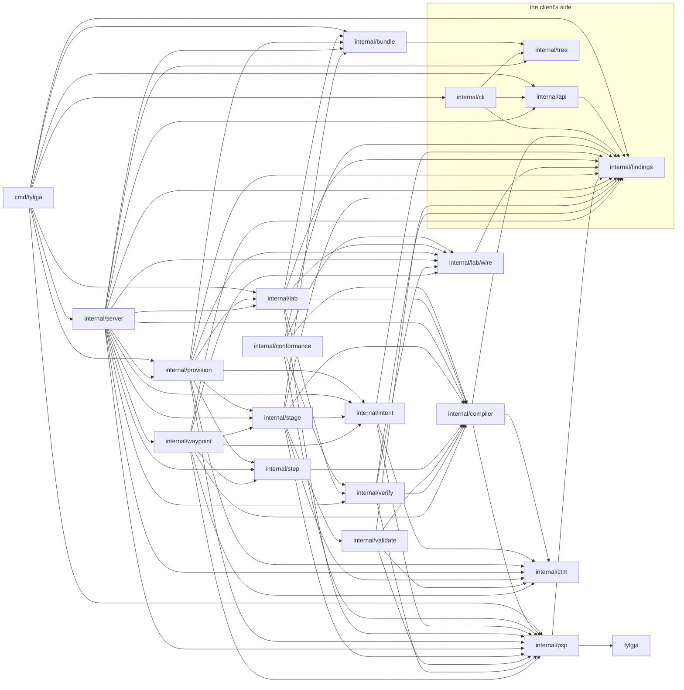

# Fylgja — Development

Engineering conventions: the local environment, repository layout, tests, Temporal
usage, and how work flows through Spec Kit. The reasoning lives in
[architecture.md](architecture.md) and the [decision log](decisions.md); this
document says what to do.

---

## Local environment

One lab host, the development host: Ubuntu 24.04.1, kernel 6.8, as a QEMU/KVM guest with
10 vCPUs and 32 GiB. Every component below was verified there; re-verify after any
upgrade, since every wrong assumption so far has been about how a dependency actually
behaved ([verified facts](verified-facts.md)).

| Component | State | Notes |
|---|---|---|
| Go | 1.26.0 | `CGO_ENABLED=0`; the binary must stay static. Ubuntu's own `go` (1.22.2) fetches go1.26.0 on first use, because `go.mod` says `go 1.26.0` (`GOTOOLCHAIN=auto`) |
| containerlab | 0.79.0 | runs without sudo for members of `clab_admins`. A guest that does not nest has no `/dev/kvm`, which only a `vrnetlab_vm` package would need. **SR Linux needs the host's rsyslog AppArmor profile widened**: add `/opt/srlinux/** mr,` and `/run/srlinux/** rw,` to `/etc/apparmor.d/local/usr.sbin.rsyslogd` and reload it with `apparmor_parser -r`, or every `nokia_srlinux` deploy fails on `log_mgr` |
| Docker | 27.5.1 | privileged containers work |
| Infrahub | 1.11.2, running | Infrahub's published Compose file, in a directory of the operator's choosing, with a `docker-compose.override.yml` beside it that pins the three Infrahub services to 1.11.2 (the published file reads `${VERSION}` and defaults to a later release) and caps Neo4j (heap 1g/2g, page cache 1g). Start it from that directory with `local/.env` loaded, which names the Compose project (`COMPOSE_PROJECT_NAME`) and the initial admin token and password; it serves http://localhost:8000. Operator-provided; not vendored |
| Temporal CLI | 1.9.1 (Server 1.32.0) | `temporal server start-dev` on `:7233`, UI `:8233`; see below |
| Temporal Go SDK | v1.49.0 (`go.temporal.io/api` v1.63.5) | in `go.mod` with `openconfig/gnmi` v0.14.1 and `grpc` v1.83.2, all pure Go. Its `testsuite` is the tier-1 workflow harness |
| gnmic | 0.49.0 | a hand tool for asking a node something, or for disabling a port outside Fylgja; **not** a dependency. The readiness probe and `twin verify` are in-process gNMI clients, so nothing Fylgja runs shells out to gnmic |
| golangci-lint | 2.14.0 | must be the v2 line: `.golangci.yml` declares `version: "2"`, which v1 rejects |
| SR Linux image | `ghcr.io/nokia/srlinux:24.7.1` | public, about 3.9 GB. Its package says `acquisition: public_registry`, so a deploy may pull it. Boots once AppArmor allows its `rsyslogd` (containerlab row) |
| cEOS image | `ceos:4.32.0.2F`, imported | **account-gated: never vendored, never pulled.** The operator downloads the cEOS-lab tar from Arista's software downloads (an account is needed) and imports it: `docker import cEOS64-lab-4.32.0.2F.tar ceos:4.32.0.2F`. It is about 2 GB, one layer and no `Cmd`, as `docker import` leaves it, and containerlab's `ceos` kind supplies the command. Its package says `acquisition: account_gated`, so the host check verifies presence under exactly that reference and **refuses the run rather than pulling**; the same image under another tag is absent. `docker` must be on the `PATH` of both the worker and the API's server, which makes every dry run |

**Credentials.** `local/.env` (git-ignored) holds the Infrahub address and token, both
node logins — `FYLGJA_SRLINUX_USERNAME`/`_PASSWORD` and `FYLGJA_EOS_USERNAME`/`_PASSWORD`,
each its image's default — and the API's token `FYLGJA_API_TOKEN`. It is the only file
that holds a value; `.env.example` documents the names and no value. Load it with
`set -a; . local/.env; set +a`. Fylgja reads the process environment only — never a file —
and never echoes, persists, or embeds a credential in a bundle, a finding, or a log line.

**Environment variables.** One binary runs in three roles, and each reads its own
([D-040](decisions.md#d-040)). **A client's command** (every command but the two roles)
reads the API's two variables and nothing else of Fylgja's, Infrahub's or a node's
(`TestTheClientReadsTheAPIsTwoVariablesAlone`, `internal/cli`):

| Variable | Default | Read by |
|---|---|---|
| `FYLGJA_API_ADDRESS` | `127.0.0.1:7650` | a client alone: `host:port`, or an `http://` or `https://` URL for a proxy the operator runs. The server's address is `fylgja serve --listen`, which has no variable |
| `FYLGJA_API_TOKEN` | none | a client, which sends it with every request and sends nothing when it is unset, holds a character no request header can carry, such as a carriage return, or ends in a space or a tab (`api.token.refused`); and the server, which compares it and refuses to start without it; never the worker. Never printed, logged or persisted ([D-042](decisions.md#d-042)) |

**The server and the worker** read the rest, at start or when a request needs them, and
never a client:

| Variable | Default | Read by |
|---|---|---|
| `INFRAHUB_ADDRESS`, `INFRAHUB_API_TOKEN` | none | the server, for every command that reads intent (`intent read`, `schema check`, the waypoint commands, a create's resolution and dry run, `twin step`'s target); the worker (the read step runs there) |
| `FYLGJA_TEMPORAL_ADDRESS` | `localhost:7233` | the server, for every command that starts, follows, cancels or lists runs (`twin show` and `twin verify` best-effort); `worker run` |
| `FYLGJA_TEMPORAL_NAMESPACE` | `default` | the same |
| `FYLGJA_STATE_ROOT` | `local` under the working directory, made absolute at start | the server and the worker, each resolving it once at start: start both from the repository root, or set it (`make worker` and `make serve` set it absolute). The conformance suite's boot half reads the twin under it and refuses it unset or relative, since `go test` runs in the package's directory (`scripts/e2e.sh` exports it absolute) |
| `FYLGJA_HOST_MEMORY_MB` | unset: the host check warns with the memory sum and proceeds | the worker's host check; the server's dry runs and `twin step`'s host check; both roles' start-up reports |
| `FYLGJA_SRLINUX_USERNAME`, `FYLGJA_SRLINUX_PASSWORD` | unset: the host check refuses | the worker's readiness probe and configuration push; the conformance suite's boot half; `twin verify`'s reads, which the server makes; the dry runs and both roles' start-up reports check presence only. The names are the SR Linux package's `readiness.login` and `config.push.login` data, not code |
| `FYLGJA_EOS_USERNAME`, `FYLGJA_EOS_PASSWORD` | unset: the host check refuses a bundle with an EOS node | the same, for a node whose package is `arista_eos`. The names are that package's data too: a host check reads the login names of each node's own package, so a twin of SR Linux alone never asks for these |
| `FYLGJA_PSP_DIR` | none: embedded packages only | the server and the worker, each also taking `--psp-dir`, and the boot half. A client's command has no `--psp-dir` (`unknown flag: --psp-dir`, exit 2, nothing sent), and is checked against the server's packages |

The server needs `containerlab` and `docker` on its `PATH`. A client needs neither.

**Temporal.** Install the CLI (`curl -sSf https://temporal.download/cli.sh | sh`, or
the release binary), then run the dev server file-backed so history survives a
restart:

```
temporal server start-dev --db-filename local/temporal.db
```

Web UI at http://localhost:8233. `make temporal-dev` wraps the command.

**Three processes on the lab host.** The dev server (`make temporal-dev`), the worker
(`make worker`) and the API's server (`make serve`, [D-041](decisions.md#d-041)). Start
the worker and the server from shells that loaded `local/.env`, from the repository root,
so they share one state root and one environment, the server adding `FYLGJA_API_TOKEN`.
Every other command is a client of the server: from a shell that holds `FYLGJA_API_TOKEN`
alone (and `FYLGJA_API_ADDRESS` off `127.0.0.1:7650`), on the lab host or, through
`ssh -N -L 7650:127.0.0.1:7650 <lab host>`, on another machine with a binary built from
this tree. The server dials nothing at start and keeps nothing between two requests, so
it starts before or after the dev server and Infrahub, and a restart loses nothing but the
answers it was sending, whose runs go on. **Restart the worker and the server after every
rebuild**: each keeps serving from a binary replaced under it, which `/proc/<pid>/exe`
then reads as `(deleted)`.

**What Infrahub needs.** Fylgja reads intent and each device's configuration artifact
from Infrahub, and never writes to it; the fixture tool (`cmd/fylgja-fixture`) is the
only binary that does. Infrahub's `main` carries:

- **the Fylgja schema**: the generics, the reference schema and the waypoint kind
  (`schema/`), loaded on `main` so that every branch created afterwards has them
  ([D-028](decisions.md#d-028)). `NetworkDevice` inherits `CoreArtifactTarget`;
- **the empty group `fylgja-devices`**, the artifact definition's target; a device renders
  only once it joins it;
- **the artifacts template**, which this repository carries: `.infrahub.yml` at the root,
  `infrahub/queries/device_config.gql` and `infrahub/templates/device_config.j2`. It
  declares one Jinja2 transform, `srlinux_device_config`, and one artifact definition
  naming the artifact `device-config`, `text/plain`, targeting `fylgja-devices`, with the
  device's name as its parameter. Register this repository on `main` as a
  `CoreReadOnlyRepository` over HTTPS with no credential ([D-044](decisions.md#d-044)): it
  tracks one `ref`, imports at creation, and never pushes. A private copy registers as a
  `CoreRepository` with a `CorePasswordCredential` holding a personal access token
  instead.

**One template renders both platforms.** The transform branches on the device's platform
and emits that vendor's syntax, so a mixed branch renders through the one artifact
definition and every device's artifact is still `device-config`. An Infrahub branch sees
`main` as it was when the branch was created, so a branch made before the schema, the
group or the template existed on `main` cannot render, and one made before the template
carried its EOS body renders no EOS text: `TestMixedSeedReads` then skips with a message
naming the template rather than failing.

**Infrahub fixture.** `make infrahub-seed` creates the `fylgja-fixture` branch with
the reference schema and the three-node SR Linux topology, joins the three devices to
the target group `fylgja-devices`, asks Infrahub to generate their artifacts, and waits
until all three are `Ready` (bounded at 90s). Infrahub 1.11.2 regenerates nothing on its
own, so the seed generates explicitly. `make infrahub-clean` deletes the branch. The
fixture branch is written once, by its seed, and by no test afterwards. If the seed fails
with `graphql: None` just after a delete, run it again. Contract tests make their own
throwaway `fylgja-test-*` branches.

**Waypoint series.** The waypoint kind (`schema/fylgja-waypoint.yaml`) is on `main`, and
waypoints are read from the default branch whatever branch they name
([D-032](decisions.md#d-032)). A test writes only series named `fylgja-test-*`, through
`testsupport`, and deletes what it wrote. The contract tier leaves none behind: after
`make test-contract`, `fylgja waypoint list` prints `no waypoints`. `fylgja-fixture` never
gains a persistent series, and the fixture tool refuses to write one naming it. A
waypoint outlives the branch it names, so a throwaway branch's series is deleted with it,
by `-delete`. An operator's own series is the operator's, written by object file, the UI
or `infrahubctl` ([schema/README.md](../schema/README.md)), and nothing here touches it.

---

## Repository layout

Single Go module, `github.com/happypathnetworking/fylgja`, one binary
([D-018](decisions.md#d-018)).

```
cmd/fylgja/            main: the root command, `--json`, `--version` (the Makefile's `-X main.version`); the two roles, `fylgja serve` and `fylgja worker run`
cmd/fylgja-fixture/    build tag `fixture`: schema load, seed (group join, generate), delete, SDL fetch, the tiers' changes to a throwaway branch, and test waypoint series. The only binary that writes to Infrahub
embed.go               package fylgja: //go:embed of schema/*.yaml, psp/*.yaml, psp/*.json
internal/api/          the API's wire (version, paths, headers, request, frames, event, files, problem, the bound) and the client that speaks it; imports internal/findings alone
internal/server/       the API's server: the twelve handlers that hold the commands' logic, the token, the per-request console, the streams and the log; imports the core
internal/cli/          the client's commands: each builds one request, prints what comes back and exits by the document; imports cobra, internal/api, internal/findings and internal/tree and nothing else of the module (test-enforced)
internal/tree/         a directory of regular files read into and written from a map, shared by internal/bundle and the client
internal/intent/       Infrahub client (genqlient), conformance, CTM projection; the waypoint reader on the default branch's unnamed endpoints
internal/ctm/          Canonical Topology Model types and JSON
internal/validate/     completeness and intent rules on the CTM; run by `intent read` and `twin compile`
internal/compiler/     CTM → bundle; pure
internal/bundle/       bundle format, canonical hashing, bundle store
internal/psp/          PSP loading, validation, embedded packages; the mapping profile (`profile.go`)
internal/conformance/  the conformance suite: the pure half, the boot half, the version rule; imported by no product code (test-enforced); reads nodes through internal/verify's readers
internal/verify/       the readers of a booted node; the assertions derived from a manifest, the record's claims, one read of the twin, the bounded wait and the report. Imports compiler, psp, findings and lab/wire, never internal/lab (which imports it) or internal/conformance; walked by the platform grep
internal/findings/     Finding, rule identifiers, the --json document, text and JSON rendering, exit codes
internal/waypoint/     the waypoint reference, its resolution to (branch, at), the list and the plan; a step's target
internal/step/         the step between two bundles, a pure function of the two, held pure by a test; the push plan and the unapplied changes a step acts on
internal/testsupport/  build tag `contract || fixture`: the contract-test harness; never imported by product code (test-enforced)
internal/stage/        the read and compile stages shared by the server's stage handlers, the provisioning activities and the dry run; imports no Temporal
internal/provision/    Temporal workflows (provision, destroy, reconcile, step) and control activities; the workflow service's client, which the server uses; worker registration and start-up report
internal/lab/          host-bound activities: containerlab shell-out, host check and image presence, staging, deploy, the gNMI readiness probe (TLS or plaintext), the configuration push (json_rpc, eapi; merge or replace), twin.json; containerlab's plan and the reconcile, the step's stage and record, and the step's VerifyTwin
internal/lab/wire/     types only: activity names and the payloads crossing the task queue; workflow files import it, never internal/lab
internal/*/testdata/contracts/<feature>/
                       frozen copies of older formats' schemas, which additivity tests read; never edited
contracts/             the current formats' contracts: the CLI and the API (cli.md, api.md) and every JSON schema (findings, show, twin, manifest, CTM, PSP, step, verify, waypoints, API frames); the tests read them here
schema/                Fylgja generics, the reference schema and the waypoint kind (YAML); infrahub.graphql, the default branch's SDL, committed, and genqlient's input (`make sdl`); README, with the guide to writing a waypoint
psp/                   platform support packages (YAML) + JSON schema; README's Supported packages table
.infrahub.yml          the artifacts template's manifest, which Infrahub reads at the repository root
infrahub/              the template's query and Jinja2 body (queries/, templates/)
testdata/              golden bundles, fixture CTMs, test-only packages (psp/heterogeneous, psp/lossy, psp/defects; never embedded), the boundary test's leaky fixture
scripts/e2e.sh         the body of `make test-e2e`
scripts/diagrams.sh    writes the import graph below and docs/diagrams/topologies.md; run by `make diagrams`
scripts/converge-loop.sh  the converge loop (Spec Kit workflow, below)
docs/                  brief, architecture, decisions, roadmap, glossary, development, verified-facts, ideas
docs/c4/               workspace.dsl, the C4 model, and its five views exported as .puml and .svg
docs/diagrams/         the fixture topologies (generated) and the schema's entity diagram
specs/                 Spec Kit features (NNN-slug), created by the first feature here
commands/              git-ignored: the command log the hooks publish (see below)
local/                 git-ignored, the default state root: .env, temporal.db, bundles/ (with bundles/.reads/, a read's CTM before compile names its bundle), twin/, command-log/
.specify/              Spec Kit: the constitution (memory/constitution.md, amended only by citing a decision-log entry), templates and scripts
.claude/               Claude Code: the project settings, the command-log hook and the Spec Kit skills
```

`internal/lab` is the host-bound boundary: everything that must run where the
containers are lives there, so per-host task queues are a dispatch change, not a
refactor ([D-015](decisions.md#d-015)). PSPs and the schema are compiled in with
`embed` and overridable from a directory at runtime.

`internal/cli` is the API's boundary on the client's side ([D-040](decisions.md#d-040),
Constitution XI). `TestClientReachesTheCoreThroughTheAPIAlone`
(`internal/compiler/purity_test.go`) follows its non-test files' imports, package by
package, to a fixed point, and fails unless the set reached is exactly `internal/api`,
`internal/findings` and `internal/tree`, or when `internal/api` or `internal/tree` imports
anything of the module but `internal/findings`, or `internal/findings` anything at all. A
second case walks `testdata/boundary/leaky`, whose one file imports `internal/stage`, and
passes only when the walk names it. So the package that holds the client's commands does
not link the core, and no flag or variable can make it run the core. Test files are not
walked: test code may call the core directly. A helper the client needs from the core is a
sign the work belongs in a server handler.

**The import graph.** The client's side (`internal/cli`, `internal/api`, `internal/tree`,
`internal/findings`) reaches the core only through the API; nothing on it imports a
package outside it. `scripts/diagrams.sh` draws every package of the module and every
import between them from `go list`, the two build-tagged test tools
(`cmd/fylgja-fixture`, `internal/testsupport`) aside; regenerate it with `make diagrams`.

<!-- import-graph -->

<!-- /import-graph -->

---

## Build and make targets

| Target | Does |
|---|---|
| `make build` | `bin/fylgja`, `CGO_ENABLED=0`. `VERSION=…` stamps `fylgja --version`; it identifies the binary and reaches no bundle ([D-024](decisions.md#d-024)) |
| `make test` | tier 1: unit, golden, workflow tests. Seconds. No infrastructure |
| `make test-contract` | tier 2: real Infrahub. Needs `local/.env`. Minutes |
| `make test-e2e` | tier 3: builds, then runs `scripts/e2e.sh`, eight cases and eight twins in one run (the [Test architecture](#test-architecture) describes them). Needs `make temporal-dev` and `make worker` running from the repository root, Docker, containerlab, **both** images and Infrahub; it starts its own server, so `make serve` need not run. `WORKER_LOG=<file>` adds the worker's log to its credential and marker greps. Never in CI |
| `make worker` | builds, then `fylgja worker run` on queue `fylgja` with the state root made absolute. Load `local/.env` in its shell first: it carries Infrahub's address and token and **both** node logins, and a worker started without them fails a create at the host check or the push. `docker` must be on its `PATH`, for the image-presence check. **Restart it after every rebuild** |
| `make serve` | builds, then `fylgja serve` on `127.0.0.1:7650` with the state root made absolute, as `make worker` does. Load `local/.env` in its shell first: the server reads Infrahub's address and token, **both** node logins and `FYLGJA_API_TOKEN`, without which it refuses to start. `containerlab` and `docker` must be on its `PATH`. It prints where it listens (API version and build), its state root, that the workflow service and Infrahub are dialled on need, the memory budget and each package as the worker prints them, and one line a request on stderr. Detached: `setsid nohup env FYLGJA_STATE_ROOT="$PWD/local" bin/fylgja serve >> local/server.log 2>&1 < /dev/null &`. **Restart it after every rebuild** |
| `make lint` | `gofmt`, `go vet`, `golangci-lint`. Runs with build tags `contract,fixture,e2e` (`.golangci.yml`), so the tagged files — `cmd/fylgja-fixture`, the contract tests and the boot half's tier-3 entry (`internal/conformance/boot_e2e_test.go`) — are linted too rather than only when Infrahub or a twin is up. `go vet -tags contract,fixture,e2e ./...` checks the same set |
| `make diagrams` | validates the C4 model `docs/c4/workspace.dsl` and regenerates every committed diagram: the five views as C4-PlantUML and SVG under `docs/c4/`, the import graph above and `docs/diagrams/topologies.md`. Two images, pinned by digest in the Makefile (`STRUCTURIZR_IMAGE`, `PLANTUML_IMAGE`) and pulled on first use, do the model's part; `scripts/diagrams.sh` needs `go`. Needs Docker; no tier needs it, and a second run changes nothing |
| `make sdl` | refetch Infrahub's SDL for the default branch, `main`, which carries the waypoint kind, into `schema/`. Infrahub's field order is not stable between fetches, so a refetch diffs by thousands of lines with nothing changed: compare two SDLs structurally, not by `diff`. The header is kept by hand |
| `make generate` | regenerate the `genqlient` client |
| `make temporal-dev` | start the file-backed dev server |
| `make command-log` | publish the command log the hooks kept (Spec Kit workflow, below) |
| `make infrahub-seed` / `infrahub-clean` | fixture branch lifecycle. The seed loads the schema, writes the three-node topology, joins the devices to `fylgja-devices`, generates their artifacts and waits for `Ready`. `go run -tags fixture ./cmd/fylgja-fixture -branch <b>` seeds a throwaway branch the same way, and changes one with `-add-link`, `-generate` (generate and wait), `-set-role <v>` (moves the artifact only), `-set-site <v>` (regenerates identical bytes) or `-disable-port <dev>:<if>`. Every change flag refuses `fylgja-fixture`. The seed and `-add-link` render and wait for `Ready` themselves; `-set-role`, `-set-site` and `-disable-port` change intent only, so `-generate` must follow them, since Infrahub 1.11.2 regenerates nothing on its own. `-mixed` seeds one SR Linux node and two EOS. `-waypoint <series>/<sequence>` writes one waypoint naming `-branch` as it stands now, with `-at <t>` for a written `as_of` and `-description <s>`; it refuses `fylgja-fixture` and any series outside `fylgja-test-`, and `-at` or `-description` without it. Compose a series by writing each waypoint after the writes it seals and after their generate has moved the artifacts: seed, `-waypoint S/1`, `-add-link`, `-waypoint S/2`. `-delete` removes every `fylgja-test-*` waypoint naming the branch, printing the count, then the branch; `-delete-series <s>` removes a test series by name. `-add-mixed-link` adds `s1:ethernet-1/3`, `e1:Ethernet3` and the link between them to a branch seeded with `-mixed`, and generates; it refuses `fylgja-fixture` and a second add on one branch. A mixed series is composed the same way: `-mixed`, `-waypoint S/1`, `-add-mixed-link`, `-waypoint S/2`. `-prepare-main` acts on `main` alone and takes no `-branch`: it loads the schema, creates the group `fylgja-devices` and registers this repository read-only with no credential when each is absent, then waits up to `-wait` (300s) for the import, so a second run writes nothing |
| `go test ./internal/compiler -update` | regenerate golden bundles after an intended compiler change. **Review the diff**: goldens enshrine bugs as readily as fixes. Three goldens, each with its `bundle_id` asserted in `golden_test.go`: `testdata/golden/three-node/` (SR Linux, `23f86a26…`), `testdata/golden/lossy/` (the design-case package beside SR Linux, `5773b6bb…`) and `testdata/golden/mixed/` (SR Linux beside two EOS nodes, `391bcb96…`). Prefer `-run TestGoldenLossy -update` so nothing else moves. A diff in the three-node or lossy golden from a change to the mapping profile or how it is applied is a defect in that change, never a re-baseline; a change meant to move them, such as a new bundle format, says so in its spec, and its re-baseline is a commit of its own |

---

## Test architecture

Fylgja's dependencies are expensive to test against: Infrahub is a multi-service
stack, containerlab needs privileged Docker, a NOS boots in minutes, Temporal is a
server. The highest-risk logic is pure so most of the suite needs none of them
([D-017](decisions.md#d-017)). Tests read the current formats' schemas from `contracts/`;
a test that holds an older format to the schema a consumer compiled at the time reads a
frozen copy under its package's `testdata/contracts/<feature>/`, and
`TestFrozenContractCopiesAgree` holds the copies of one schema equal.

| Tier | Covers | Runs | Needs |
|---|---|---|---|
| 1 — Unit + golden + workflow | **The compiler and its formats**: the three goldens, each fact asserted by name, and the lossy golden's shuffled fixture; every mapping kind, shared port, omission and refusal, worded alike by validation and the compiler; every `psp.*` rule from its fixture under `testdata/psp/defects/`; bundle hashing and verification, a bundle of another format refused naming both; `step.Diff`, `PushPlan` and `Unapplied`, pure. **The read**: the CTM projection, every artifact refusal and conformance's `schema.artifact_target.missing` from an `httptest` Infrahub; the waypoint reference's every shape and every resolution refusal, none reading the branch. **The node**: each push mechanism, merge and replace, against an `httptest` node (the request in order and in one call, a refusal's reason cut with no configuration line kept, `commit validate` after a cut refusal, the device's diff in the result and in no log line); the gNMI readers and the readiness probe against in-process gNMI servers, TLS and plaintext; `twin verify`'s every assertion and claim outcome against a faked reader; the conformance suite's pure half over every package meant to load, and the boot half's every check and wording against a faked reader. **The workflows**, on the Temporal Go SDK test suite with mocked activities: every outcome of provision, destroy, the reconcile check and step, the step's wait among them; and nine histories recorded from the dev server replayed with `worker.WorkflowReplayer` where the test suite departs from the service. **The API and the commands**: every client's command run through a server in the test's own process (`internal/cli`'s harness: one `httptest` server over a `server.Server`, a token made for the run, every byte the server writes recorded); every refusal made before any connection, with nothing dialled; each operation's answer under each rendering, every frame valid against `contracts/api.schema.json`; a run started, followed, interrupted and left by its client; the client's own failures and environment; `fylgja serve`'s refusals and report; the boundary test. **Secrets**: the marker proof (an artifact's bytes reach the bundle and no finding, log line, payload, record or answer) and the token in nothing the server writes | every PR, seconds | nothing |
| 2 — Contract | the read against a real Infrahub with the reference schema loaded: conformance and completeness findings; a pinned read reproduces its bundle after the branch changes (`TestPinnedReadReproducesItsBundle`); two reads of an unchanged branch compile to one `bundle_id` and a change moves it (`TestFollowingDetection`); a seeded branch reads with every artifact, a role change moves the id and a site change regenerates identical bytes and moves nothing, and a device outside the target group, or in it before its first generate, is `artifact.missing` (`TestArtifactOnASeededBranch`); a kind that does not inherit `CoreArtifactTarget` is named; a mixed branch reads three devices of two platforms and compiles with both bootstrap routes and both forwarding entries (`TestMixedSeedReads`, which skips naming the template when an EOS device's artifact is SR Linux text); a waypoint resolves to the `at` and the id `--at` gives, and a series plans to each waypoint's own id (`TestWaypointResolvesLikeAt`); the waypoint kind loads, reads across branches and refuses a duplicate (`TestWaypointKindLoads`); `schema check` through the harness's server (`internal/cli/schema_contract_test.go`). Every branch and series it writes is `fylgja-test-*` and is deleted by the test. The token case has no live oracle, because this Infrahub reads anonymously | locally before merge; in CI once CI has an Infrahub | Infrahub in Docker |
| 3 — End-to-end | eight cases and eight twins in one run, every command through a server the script starts (below) | on demand (`make test-e2e`) | dev server, worker, privileged Docker, **both** NOS images (the cEOS one imported by hand), Infrahub |

**Tier 3, as `scripts/e2e.sh` runs it.** Before anything runs the script checks the cEOS
image is present under the reference `psp/arista_eos.yaml` names, and stops saying to
import it, since it is never pulled. After the workflow service's health check it makes a
token for the run (never exported), starts `bin/fylgja serve --listen 127.0.0.1:0` from
the tree in its full environment, logging to `$OUT/server.log`, and reads the port the
system chose. Every `fylgja` command, the trap's destroy included, runs with `PATH`,
`HOME` and the API's two variables alone, as `env -i` would; `gnmic`, Docker,
containerlab, `twin.json`, the store, the boot half, the fixture tool and case 3's
short-lived worker stay direct. The cases:

1. **A create.** `twin create --no-follow` from `fylgja-fixture`, to three ready SR Linux
   nodes with the compiled `bundle_id`; each node read back over gNMI (its `ethernet-1/1`
   description is the one its staged artifact sets, and `twin.json`'s checksums are
   Infrahub's); the conformance suite's boot half against it; `twin verify --json` (three
   host names, six ports, six link ends and three record claims held, nothing skipped); a
   second create refused naming the twin; destroy.
2. **Another reference.** A create `--at T`, T taken once the fixture's three artifacts are
   `Ready`; destroy.
3. **An orphan.** A one-node lab `fylgja` deployed by hand, named an orphan by a
   short-lived worker of the script's own and by a dry run, and cleared by destroy.
4. **Reproducibility.** The create `--at T` again, with the same `bundle_id`; destroy.
5. **Following.** A throwaway branch `fylgja-test-e2e-<pid>` is seeded and followed at
   `--interval 15s`. An unchanged check touches neither `twin.json` nor the containers. An
   artifact-only change (`-disable-port n1:ethernet-1/2 -generate`) is rebuilt with no
   command, n1 then reads `disable`, and `twin verify` skips that port and both ends of its
   link. A link change (`-add-link`) is rebuilt to the compiled `bundle_id`. `twin show
   --json` names both states; destroy stops following and leaves no Schedule; the branch is
   deleted.
6. **Two vendors.** A throwaway branch seeded with `-mixed` (one SR Linux node, two EOS),
   created to three ready nodes, each read back over its own package's transport (SR Linux
   over TLS gNMI on 57400, EOS plaintext on 6030); the boot half and `twin verify` (both
   cross-vendor links held); `twin show --json` asserting each node's package; destroy, and
   the branch deleted.
7. **A waypoint series.** A throwaway branch and a series of the same name,
   `fylgja-test-e2e-wp-<pid>-<n>`: seed, `-waypoint …/1`, `-add-link`, `-waypoint …/2` once
   the artifacts have moved. `waypoint plan --json` gives two ids and one step (a link
   added, n1 and n3 changed, their artifacts included), and `waypoint list --json` lists
   both. `twin create --waypoint …/1` carries the plan's first id, its `twin.json` names the
   waypoint, and `twin show` calls it pinned; it is read back against the artifacts Infrahub
   held when `…/1` was written; destroy. The same from `…/2` with the second id; destroy;
   `-delete` removes the series with the branch.
8. **A step.** A throwaway mixed branch and series `fylgja-test-e2e-step-<pid>-<n>`:
   `-mixed`, `-waypoint …/1`, `-add-mixed-link`, `-waypoint …/2`. A create from `…/1`, every
   node holding its id. `twin step --dry-run` and `twin step` without `--allow-restart` are
   each refused `step.restart.required` naming `e1`, with `twin.json` and the containers
   unchanged. `twin step --allow-restart` takes it to the plan's second id: `e1` restarted
   in place, `s1` and `e2` untouched, both pushes landed, every node holding the second id,
   the new link seen from both ends over gNMI, `s1`'s `ethernet-1/3` description the one
   `…/2`'s artifact sets, and the step's wait `settled` in both `twin.json` and the step's
   document. The step back to `…/1` leaves that description path answering no value and no
   error, since the replace removed what `…/2` added. Destroy, and `-delete`.

Every artifact carries `FYLGJA-MARKER` in its role comment, and the script finds it, and
the API's token, `local/.env`'s token and both passwords, in no output, record, document,
decoded run history or server log (or the worker's, with `WORKER_LOG`): the marker only in
a read's CTM and a compiled bundle. The server is stopped before the greps, and one that
does not exit 0 on SIGTERM fails the run. The script leaves the host clean: a leaked lab,
twin directory or Schedule `fylgja-follow` exits 99, and the trap deletes the branches and
their series. Its closing lines give the wall time and each case's timings.

**The conformance suite** (`internal/conformance`) is `go test` in two halves, and
decides whether a package is supported. Its wordings are held by its own tests, and
`psp/README.md` records which packages pass:

```
go test ./internal/conformance -run TestPureHalf -v      # the pure half; tier 1, part of make test
set -a; . local/.env; set +a                              # both probe logins, for the boot half
FYLGJA_STATE_ROOT=$PWD/local go test -count=1 -tags e2e ./internal/conformance -run '^TestBootHalf$' -v
```

The pure half needs nothing and runs on every package meant to load: `psp/*.yaml` (read
from disk and held equal to what the binary embeds), `testdata/psp/heterogeneous/` and
`testdata/psp/lossy/`, never `testdata/psp/defects/`. The boot half needs a twin that ended
`ready` under that state root, and reads it: it boots nothing, and with no twin it fails
saying so. `scripts/e2e.sh` runs it in cases 1 and 6; by hand, run it against a twin made
with `twin create --no-follow`. The `-run` is anchored, because `TestBootHalf` alone also
matches `TestBootHalfFaked` and the other tier-1 tests of the half, whose faked nodes'
lines would sit beside the real ones. A new shipped package gets its README row only from
a tier-3 run on the final binary.

Rules:

- **Compiler purity is enforced by a test**: compile the fixture twice and compare
  bytes; compile with a poisoned clock and environment. A test also holds that no product
  code imports `internal/conformance`, and that no non-test source names a platform,
  comments included, for every platform name the tree knows. The grep
  (`TestCompilerNamesNoPlatform`) walks named directories, not the whole of `internal/`:
  the compiler, `psp`, `lab`, `provision`, `stage`, `bundle`, `validate`, `step`,
  `waypoint`, `verify`, `api`, `server`, `cli` and `tree`. A new package joins it only by
  being added to that list. `internal/step` is also held pure by a test in the compiler's
  shape. That grep is how [D-031](decisions.md#d-031) is enforced: a mechanism is keyed by
  a format value, never by which platform is being provisioned.
- **Contract tests use a real Infrahub, never a fake.** Generics resolution and
  time-travel are the integrations most likely to surprise us.
- **Workflow tests use Temporal's `testsuite`**: retry, timeout, cancellation and
  cleanup-on-failure paths, without a server. Where the testsuite departs from the
  service — it settles a cancelled activity at once — a history recorded from the dev
  server is replayed with `worker.WorkflowReplayer` instead, still without a server. A
  recorded history is scrubbed of the host's name, the state root and the device's diff
  before it is committed.
- **End-to-end never gates a PR.** Its job is catching what the other tiers
  structurally cannot.
- **Tier 3 and the hand checks run on a quiet host.** A twin boot must not overlap
  `make test-contract` or other heavy work: a starved worker misses heartbeats, so its
  deploys are cut short and retried until the step fails, and Infrahub times out the
  contract tier. Tier 3 takes about 17–19 minutes on the development host: eight twins,
  two rebuilds, two steps that restart a cEOS node and an orphan boot. Read `free -m`
  before it, give the host room and rest it between runs. It starts and stops a worker of
  its own to see orphan detection at start; the stopped worker stays listed as a poller
  for about five minutes, which is harmless. Restart the worker after every rebuild,
  before the run: the refusals are worded by the worker's binary, and a stale worker
  fails case 1.
- **Every finding, rejection and skip has a stable identifier** and a test that
  produces it.

---

## Temporal conventions

Workflow code and activity code follow different rules; keep them in different files
and keep the workflow files short.

**Workflows are deterministic.** No I/O, network, filesystem or environment.
`workflow.Now` and `workflow.Sleep`, never `time.Now` or `time.Sleep`.
`workflow.SideEffect` for anything random. No map iteration where order affects a
decision. `workflow.Go` and `workflow.Selector`, not goroutines and `select`. Changing
a workflow's logic uses `workflow.GetVersion`; since every workflow is short, the
exposure is small.

**Activities are idempotent and small.** Deploy checks for the lab before deploying;
destroy tolerates absence; the host check only reads. Activities take and return
paths, hashes and IDs, never bundle bytes. `DeployLab` and `AwaitReadiness` heartbeat
and carry start-to-close budgets from the PSP.

**Activities by name.** Workflows schedule activities by the names in
`internal/lab/wire` and pass its payload types; workflow files import `wire`, never
`internal/lab`, and a tier-1 test holds them to their imports. The worker registers each
activity method under its name (`lab.Activities.Names`).

**Cleanup.** `provision` runs `DestroyLab` and `UnstageTwin` on a disconnected context
from every failure and cancellation path after the host check. There is no sweeper; a
leaked lab in end-to-end is a bug, not a flake. A step tears nothing down: its cleanup is
`RecordStep`, run on a disconnected context from every path after its stage, which
writes the twin `diverged` when the step failed or was cancelled
([D-036](decisions.md#d-036)).

**Cancellation waits for the activity.** Host-bound activities are scheduled with
`WaitForCancellation: true`, and the worker sets `MaxHeartbeatThrottleInterval: 10s`
beside `lab.HeartbeatInterval: 10s` ([D-030](decisions.md#d-030)): a shorter window lost
working deploys to heartbeats a loaded host could not answer, and the price is that a
cancellation arrives on the next 10s heartbeat. Without the first, cleanup starts while a
cancelled `clab deploy` is still running; without the second, the cancel reaches a
heartbeating activity only on its next throttled heartbeat, at 80% of the heartbeat
timeout. The SDK's `testsuite` ignores `WaitForCancellation`, so no workflow test can show
the ordering: the options test pins the option instead.

**A step can finish after its cancellation.** Under `WaitForCancellation`, an activity
that does not see the cancellation — `CheckHost` and `RecordTwin` never heartbeat; a deploy
can finish before its next heartbeat — returns its result with no error. `Provision`
checks `ctx.Err()` after each host-bound step returns, so such a run still ends cancelled:
untouched at the host check, cleaned up after it. The testsuite cannot show this either,
so tier 1 replays histories recorded from the dev server
(`internal/provision/testdata/*.history.json`) through `worker.WorkflowReplayer`, which
runs the SDK's own event handlers.

**Start options are pinned, because their absence is silent.** `fylgja-provision` starts
with `WorkflowExecutionErrorWhenAlreadyStarted: true`; without it the SDK swallows the
server's already-started error and a second `create` attaches to the first and reports
its result as its own. `fylgja-destroy` starts with the `USE_EXISTING` conflict policy,
so a second destroy attaches to the one in flight. `fylgja-step` starts as
`fylgja-provision` does (`stepStartOptions`), so a second step is refused naming the
first. All three are asserted in tier 1.

**An interrupted start terminates its run.** A command starts nothing while no worker polls
the queue. It then sends the start request where an interrupt does not reach it, under
`provision.StartRequestBudget` (10s): cut short, the request could leave a run the service
had accepted with no run id to terminate it by. It waits `DefaultFirstTaskGuard` (10s) for
a worker to take the run's first task, since a worker that stopped in the last five
minutes is still listed as polling. An interrupt during that wait, like no worker within
it, terminates the run before anything in it has run; the terminate is itself sent on a
context the interrupt does not reach, bounded by 10s (`awaitFirstTask`). All three bounds
are mechanism constants, not platform budgets.

**Provision returns a result rather than failing.** A run that was refused, failed or
was cancelled still completes, returning its outcome, findings and cleanup status
(`provision.ProvisionResult`); Temporal records it as completed, and the outcome becomes
the document's status, by which the CLI exits. Progress lines come from the run's event
history, never a query or a signal.

**A `clab` left running by a killed worker is stopped before the retry acts.**
containerlab runs in its own process group, and cancelling the activity kills the group.
It is also started with `Pdeathsig: SIGKILL` from an OS thread locked for the child's
lifetime, but that signal never reaches containerlab: it is installed setuid root, and the
kernel clears the parent-death signal when a setuid binary starts, so a `clab deploy`
outlives a worker killed under it and carries on. `DeployLab` and `DestroyLab` therefore
first stop any `clab` still deploying or destroying lab `fylgja` (`Clab.StopStrays`), and
only then act, so two deploys of the lab never overlap. A retry after a killed deploy finds
a partial lab and deploys with `--reconfigure`, since a plain re-deploy skips
containerlab's post-deploy and leaves the bootstrap unapplied. `StopStrays` waits up to
10s for the killed `clab` to exit, looking every 100ms (`lab.StrayStopTimeout`,
`strayPollInterval`), then gives up and names its pid; the runner itself waits 5s for a
killed child's output pipes to close (`lab.childWaitDelay`, set as `exec.Cmd.WaitDelay`).
Both are mechanism constants, not platform budgets.

**A lost heartbeat is named.** The SDK abandons an activity attempt at the first
heartbeat call that fails, cancelling its context with that call's error as the cause. A
call fails once it has gone unanswered for about half of `MaxHeartbeatThrottleInterval`,
whether the service is unreachable or only slow. A host-bound step cut short this way
reports the cause under its own rule and stays retryable; a cancellation the workflow
asked for is still returned as a cancellation.

**Following is a Schedule** ([D-026](decisions.md#d-026)). An unpinned twin is followed by
the Schedule `fylgja-follow`, which starts a `Reconcile` check every interval. The check
reads and compiles the branch and compares the `bundle_id` with the twin's record; a
changed id is rebuilt through the `fylgja-destroy` and `fylgja-provision` children. The
Schedule holds the interval and the branch and nothing else. Its bounds are mechanism
constants, not platform budgets: the interval defaults to `provision.DefaultInterval` (5m)
and is refused below `provision.MinInterval` (10s); the Schedule's catch-up window is
`provision.FollowCatchupWindow` (1m), so a workflow service outage never replays missed
intervals, and its jitter is `provision.FollowJitter` (0). `InspectTwin`, `RunsInFlight`,
`StartFollowing` and `StopFollowing` carry start-to-close budgets of 30s each
(`InspectTwinBudget`, `RunsInFlightBudget`, `FollowBudget`) with the provisioning run's
retry policy. `StartFollowing` and `StopFollowing` are scheduled with
`WaitForCancellation: true` too: neither heartbeats, and without it a run cancelled during
one ends before the Schedule is created or deleted. `twin show`'s whole conversation with
the service is bounded by `provision.ShowServiceBudget` (5s); past it the service is
reported unreachable.

**The push is versioned, and its budget is the package's.** The provisioning run's push
step is under `workflow.GetVersion(ctx, provision.PushVersionID, workflow.DefaultVersion,
1)`, with the change id `"push"`: a history recorded before the step existed carries no
marker, replays at `DefaultVersion` and skips the step. That branch is a replay path only.
The same way is open to every later change to a workflow's steps.
`provision.PushOptions(node, plan)` gives each node's `PushConfig` its own package's
`push_timeout_s` plus `provision.PushMargin` (15s) as start-to-close, a 30s
`HeartbeatTimeout`, `WaitForCancellation` and three attempts (a retry sends the same
bytes). Its schedule-to-start is `provision.PushStepBudget(plan)`, the largest
`push_timeout_s` among the bundle's platforms plus the margin, so a push no worker takes
still fails, as readiness's step budget does. The margin, heartbeat and retry are
mechanism constants; every duration a platform decides is `config.push_timeout_s`. The
push request's own deadline is the activity's remaining budget, not a constant. The push
reads at most `lab.jsonRPCAnswerLimit` (4 MiB) of a node's answer, a mechanism constant
too: an answer echoes the command list, so it is about the artifact's size, and SR Linux
caps its own error message. An answer cut at the limit is not parsed for a refusal; it is
reported `push.failed` ("a body that is not a JSON-RPC answer") and retried.

**Two mechanisms deliver a push**, each selected by the package's `config.delivery` and
by nothing else about the platform ([D-031](decisions.md#d-031)). `json_rpc` is JSON-RPC
`cli` over HTTPS. `eapi` is one eAPI `runCmds` request over HTTPS to `/command-api`, in a
**named configuration session** — `enable`, `configure session fylgja-<attempt>-<ns>`,
the lines, `commit` — because a committed session name cannot be reused, and a refused
session is **aborted before the next attempt** so no candidate is left dirty. Where the
package says its bootstrap arrives that way (`config.bootstrap_via: push`), the bootstrap
file's lines go ahead of the artifact's in the same request, and a refusal's line number
is re-based onto whichever file the line came from. The node may answer a line with a
**warning** rather than a refusal; the push logs the count and the line numbers and
**never the line's text**, since an eAPI error echoes every command it was sent. A push
that finishes after its run's cancellation still ends the run cancelled: two histories
recorded from the dev server (`cancel-during-push`, `push-after-cancel`) pin it in tier 1.

**The push is a replace** ([D-033](decisions.md#d-033)). Both shipped packages declare
`config.mode: replace`, and the arm each `delivery` selects resets the candidate to the
baseline containerlab left on the node, sends the bootstrap (whatever `bootstrap_via`
says), then the artifact, asks for the device's diff and commits, in the one request:
`enter candidate private`, `load startup`, …, `diff flat`, `commit now` on `json_rpc`;
`rollback clean-config`, `copy startup-config session-config`, …, `show session-config
diffs`, `commit` on `eapi`, sent with `format: text`, since the diff command has no JSON
model. A package on `merge` sends the bootstrap and the artifact over what the node runs,
and creates but cannot step. The diff is `wire.PushResult.Diff`, cut at `lab.DiffLimit`
(256 KiB, a mechanism constant: an activity result must stay under the service's payload
limit); the step workflow strips it before any other input or result is built, and
`PushConfig` logs its length alone (`diff_bytes`), so the run's history is its only home.
A JSON-RPC refusal's reason is cut at its first empty line and loses any `insert /`,
`delete /`, `update /` or `replace /` line, since under a replace the node appends the diff
to its error. SR Linux cuts its error message at about 1 KiB, inside its echo of the
commands, so a replace's refusal often carries no reason. The arm then asks once more,
`enter candidate private`, `commit validate`, on the same deadline, and a refusal is told
before the budget, so a second request cut by the deadline cannot turn `push.refused` into
a retried `push.failed` ([D-034](decisions.md#d-034), [D-035](decisions.md#d-035)).
`pushByHand`'s debug line follows the same lists.

**A step is a third short workflow** ([D-036](decisions.md#d-036)). `twin step` makes
every refusal before any connection to the service, in the API's server: the host as
`twin show` reads it, the target (`waypoint.Target`, then the waypoint's resolution), the
read, compile and filing (`waypoint.Build`, `waypoint plan`'s path), the from bundle from
the store, the host check in-process with the two presence refusals dropped, and
containerlab's plan (`Clab.DeployPlan`: `clab deploy --dry-run --format json` on the
store's copy of the target, with `CLAB_LABDIR_BASE` at the twin directory, which writes
nothing). Then `StartStep` starts `fylgja-step`, which runs `InspectTwin`, `CheckHost`
and `PlanReconcile` as second locks, then `StageStep` (the swap of `twin/bundle` through
`.bundle.next` and `.bundle.prev`), `ReconcileLab` (`clab deploy` **without**
`--reconfigure`), `AwaitReadiness` for each restarted, recreated or created node,
`PushConfig` for each node of the push plan, and `RecordStep`. Its activities are
registered under their `wire.Act*` names, and every budget is an existing one:
`CheckHostOptions` for the plan, `StageOptions`, `DeployOptions` for the reconcile,
`ReadinessOptions`, `PushOptions`, `RecordOptions`. `ctx.Err()` is checked after every
step: a cancellation before the stage records nothing (exit 2), one after it lets the
activity finish and records the twin diverged (exit 4). `twin destroy` cancels a running
step after the provisioning run, waits for its record, then destroys. The SDK's test
suite settles every cancelled activity at once, so two recorded histories
(`step-diverged`, `step-cancelled`) pin the cancellation and the diverged record in
tier 1.

**A step waits for the twin to settle after its record** ([D-039](decisions.md#d-039)).
`Step` schedules `VerifyTwin` after `RecordStep` under `workflow.GetVersion(ctx,
provision.VerifyVersionID, workflow.DefaultVersion, 1)`, change id `"verify"`, so a step
history recorded before the wait existed replays at `DefaultVersion` and schedules
nothing. It runs after every record, stepped, unchanged or diverged, on the run's own
context (never a disconnected one), and is skipped when the run was cancelled before it.
`provision.VerifyOptions(budgetS)` gives it the budget (`StepInput.WaitS`, from `twin step
--wait`, 120s by default, `verify.DefaultBudget`) plus `provision.VerifyMargin` (30s) as
both start-to-close and schedule-to-close, the provisioning run's heartbeat and
`WaitForCancellation`, so a `twin destroy` that cancels the step during the wait has the
activity record `cancelled` and return its result. Its input carries the record's time as
`From`, so a retried attempt computes the same deadline. The activity writes `step.wait`
into `twin.json` only when the record's step names its run, returns the record it finds
already written on a retry, and records `cancelled` only for a cancellation the run asked
for. Any other cut writes nothing: a lost heartbeat or a stopped worker is retried inside
the one window, from the same `From`, and the end of the window is not retried, so the run
gives `could not complete: <the timeout's finding>; the record's wait is null`. The
workflow touches nothing of the step's outcome, phase, findings or timings for it; a wait
that did not settle adds the warning `verify.wait.unsettled`. `verify.ReadInterval` (1s,
the readiness probe's pause), the budget and the margin are mechanism constants, and every
duration a platform decides is still the package's probe. A recorded history
(`step-wait-cancelled`) pins a destroy during the wait in tier 1.

**Naming.**

| Thing | Name |
|---|---|
| provision workflow ID | `fylgja-provision` (fixed) |
| destroy workflow ID | `fylgja-destroy` (fixed) |
| follow schedule ID | `fylgja-follow` (`provision.FollowScheduleID`) |
| check workflow ID | `fylgja-reconcile-<scheduled time>`; the service appends the time to `provision.WorkflowReconcile` |
| step workflow ID | `fylgja-step` (fixed; `wire.StepWorkflowID`, `provision.WorkflowStep`) |
| the step's wait | activity `VerifyTwin` (`wire.ActVerifyTwin`), version change id `verify` (`provision.VerifyVersionID`), findings step `observe` |
| task queue | `fylgja` |
| containerlab lab name | `fylgja` |
| twin directory | `<state root>/twin/` |
| bundle store | `<state root>/bundles/<bundle_id>/` |

---

## CLI conventions

Noun-verb ([D-019](decisions.md#d-019)). `twin create` is the front door; every stage
has its own command sharing code with its tests.

- Stage commands read and write files an operator can inspect and diff: CTM JSON,
  bundle directory. The files are on the client's disk and cross the API whole.
- **Every command but the two roles is a request to the API**
  ([D-040](decisions.md#d-040)). Its logic is a handler in `internal/server`, and its
  command in `internal/cli` builds one request, prints the frames that come back and exits
  by the document's status. A new command is a new operation: a path, a handler, a
  client's command, and tests that run it through the harness's server. Every refusal with
  a rule is the server's; the client words only its own transport failures, a file on its
  own disk and its argument parser's errors. `--psp-dir` is a flag of `serve` and
  `worker run` alone.
- Human output on stdout; `--json` on every read command; errors on stderr with the
  stable finding identifier.
- `twin create`, `twin provision` and `twin step` say what they will do under `--dry-run`.
- Credentials are never flags; environment only. A client holds one, the API's token.

**The API's mechanism constants** (`internal/api/wire.go`, `internal/server/streams.go`,
`internal/server/follow.go`, `cmd/fylgja/serve.go`), none a platform's budget:
`api.Version` (`"1"`, the first element of every path); `api.DefaultAddress`
(`127.0.0.1:7650`, where the server listens and a client looks unless told);
`api.MaxRequestBytes` (32 MiB of request body, refused `413` before anything is decoded or
filed); `api.MaxFrameBytes` (64 MiB, one frame a client will read); `api.DialTimeout` (5s,
the client's connection); `api.HeaderTimeout` (30s, from a request sent to its answer's
headers, which the server sends before it works); `api.ExpectContinueTimeout` (1s, how long
a request carrying files waits for `100 Continue` or a refusal before it sends its body, so
a `401` arrives before any of the body is sent); `api.MaxProblemBytes` (64 KiB, what a client
reads of a transport fault's body); `api.StreamBytes` (16, the random bytes of a stream
identity, in hex) and `api.MaxStreamLength` (128, the characters of a `Fylgja-Stream` the
server takes); the server's `ReadHeaderTimeout` (10s) and `IdleTimeout` (120s);
`streamCapacity` (2, the interrupts held for a handler); `cancelRequestBudget` (10s, the
start's terminate budget's: the request that asks a run to cancel once an interrupt was
delivered, which the client's departure does not end); and `provision.ShowServiceBudget`
(5s), a field of the server. The server sets no write timeout: an answer lasts as long as
its run. It sets `DisableGeneralOptionsHandler`, so `OPTIONS *` reaches the token's check
and the log as every other request does, rather than `net/http`'s own `200`.

---

## Spec Kit workflow

Each [roadmap](roadmap.md) item is one or more features, each a directory
`specs/NNN-<slug>/`. The sequence is `/speckit-specify` → `clarify` → `plan` → `tasks` →
`analyze` → `implement` → `converge`, repeating `converge` until nothing is added.
Auto-commit hooks stay off; commit with a conventional-commit message whose body says
*why*.

**The specify prompt carries decisions, not restatement.** Every command starts from
`CLAUDE.md`'s reading list — brief, architecture, decision log, roadmap, this document —
and the constitution, and a feature's spec can point at the previous one, so a prompt that
repeats them adds nothing, and a longer prompt does not buy a longer or better spec. A
feature's `brief.md` can hold the full reading list, so the prompt itself is one line.
Write, in this order:

1. The item and where its shape is fixed: `M8 — Object storage and Temporal cluster, as
   docs/roadmap.md defines it`, the architecture sections and decisions that decide it,
   and "specify what the operator gets, not a new design".
2. Every behaviour change, named, so that any other difference from what is built is a
   defect.
3. **Decided:** what you have already chosen, one sentence each, with the reason when it
   is not on disk.
4. **Open, for clarify:** what you have not settled, each question with its options.
   Clarify asks at most five.
5. **Exit:** what each tier proves, and anything owed before the work starts.

Leave out what is already on disk: the item's goals, what is built, the out-of-scope list.
Cut restatement, never a decision: a choice you have made but do not write down does not
reach the spec, and at best clarify asks you for it again.

**Commands are logged automatically.** Two Claude Code hooks in `.claude/settings.json`
run `.claude/hooks/command-log.py`; nothing depends on the model. When a `/speckit-*`
command is typed, `UserPromptSubmit` snapshots git `HEAD` and the feature's `tasks.md`
checkboxes to `local/.command-start/`. After every turn, `Stop` reads the session
transcript from that command to the next one and keeps one record in the git-ignored
`local/command-log/pending.jsonl`, with the directory it belongs in:
`specs/NNN-slug/commands/` when a feature resolves, otherwise `commands/`. The hooks write
no tracked file, so a turn that ends after a commit leaves the tree clean. **The command
log is git-ignored here**: `make command-log` (`command-log.py flush --commit`) publishes
each pending record into its directory's `runs.jsonl`, with its human-readable entry in
`log.md` beside it, under `commands/` and `specs/*/commands/`, and commits nothing, since
both are ignored. The loop's stopping rule reads `tasks.md`'s tags, never the log. Run it
after `/clear` or when closing a session, so the last turn's entry is in; pending records
wait in `local/` until then, and are never lost by waiting.
`scripts/converge-loop.sh` publishes whatever is pending before it starts, and after each
session.

A run is split into segments at each prompt the operator types: segment 0 is the command,
each later prompt a follow-up. Every segment keeps its prompt verbatim, report, models,
effort, active time, context before and after, and tokens (de-duplicated by request;
subagents apart). The record sums them three ways: `command` (segment 0, the number for
estimates and model comparisons), `follow_ups`, and `total`; time spent waiting on the
operator is in none of them. For `/speckit-clarify` the operator's answers are follow-ups,
so use `total` there. The run also records tool calls and errors, files edited, `HEAD`
before and after, and the tasks checked and added. `log.md` carries the command's metrics,
one follow-up summary line, and every prompt, not the reports. The pending entry is
rewritten after each turn until the next `/speckit-*` command, and a publish replaces the
published one in place. `command-log.py replay <transcript> --out <dir>` runs the same
logic over a saved transcript. The transcript format is Claude Code's and undocumented
(verified on 2.1.272); a missing field is reported as a problem, shown in the session,
never written as zero.

**Model and effort per command.** Every command but `clarify` runs in a fresh context:
`/clear`, then `/model` when the row changes the model or the effort, then the command.
`clarify` runs in `specify`'s context, on the same model, because its input is the spec
that context just wrote and staying warm skips the re-read. Each command reads its inputs
from disk and the command log keeps the prompts, so nothing in the transcript is needed by
the next command, and a switch on an empty context costs nothing. Switching mid-session
re-reads the whole context uncached under the new model, because prompt caches are
model-scoped; the same is true of an effort change. Both models write at about the same
rate, so a command takes the same time on either; the choice is price against judgment.

| Command | Model | Effort | Why |
|---|---|---|---|
| specify | Fable 5.1 | high | the spec is what every later command reads |
| clarify | the model specify used, in specify's context | high | most of its time is the operator's answers; staying warm skips a re-read |
| plan | Fable 5.1 | high for a port; xhigh for new design | the largest single command; live verification and the Constitution Check happen here |
| tasks | Opus 5.5 | high | its follow-ups are where the plan's conflicts surface; answer them in the same context |
| analyze | Fable 5.1 | high | read-only, then the fixes are applied as follow-ups; a second pass is short |
| checklist | Sonnet 5 | medium | optional |
| implement, planned and converge-appended runs | Opus 5.5 | xhigh | Fable costs 2.5 times as much per token for no gain in speed; a converge-appended run is one or two tasks, so xhigh costs little |
| converge | Opus 5.5 until it reports converged, then Fable 5.1 | xhigh | the same time per pass on either; the stopping rule below bounds the tail |
| `/converge-loop` (the attended session) | Opus 5.5, the settings default | high | it implements nothing: the loop's own sessions are fixed by the script at Opus 5.5, xhigh. Its judgement is a reading — the `continue` or `hold` verdict, and where an answer belongs — not a design |

Project settings that back this (`.claude/settings.json`): `model: "opus"` (an alias, Opus
5.5), `effortLevel: "high"` (Opus 5.5's own default is `medium`, so the setting matters),
`promptCacheTtl: "1h"` so the cached governance documents survive a review pause between
commands. The settings are the `tasks` row; every other row is a `/model` after `/clear`,
except `clarify`, which stays in `specify`'s session. Effort follows the row, not the
session.

**Stopping rule for converge.** Convergence ends after two consecutive passes that
change no behaviour — passes whose every appended task is a test, a doc line or a named
constant with the code under test unchanged — or after a pass that appends nothing,
whichever comes first. Implement what the last pass appended, run the tiers, and stop:
the tiers verify those tasks, not another pass. A pass that changes behaviour resets the
count.

**The converge loop** (`scripts/converge-loop.sh`) runs a feature from its tasks to
convergence unattended, in two stages.

1. **The planned runs.** The runs come from `tasks.md`'s "Recommended route", and each line
   is its run's prompt, as when it was typed. After them comes each phase's unchecked tasks
   the route does not name. A run whose tasks are all `[X]` is skipped, so a stopped loop
   resumes where it stopped.
2. **Convergence.** Converge tags every task it appends `[behaviour]`, `[pin]` or
   `[operator]` (attended, also `[live]`), and the stopping rule is applied from the tags.

Each command is a headless `claude -p` session on its row's model and effort, so the
fresh-context rule holds. **The loop commits and never pushes**, the one exception to
committing by hand:

- Each implement session commits its own work, split as the repository splits it.
- The script commits converge's phase, and publishes each session's command-log entry,
  which commits nothing here.

After each implement the pure gates run: build, static, `make test` and `make lint`. The loop
stops, and hands back, at the first of these:

- the rule is met, or a pass appends nothing;
- a run the operator owns (attended, below, each of these is a question instead):
  - its line names tier 3, the hand checks or a quiet host (or tier 2, when the sessions
    have no Infrahub credentials);
  - it carries an `[operator]` tag;
  - or implement left one of its tasks unchecked;
- a run that moved `testdata/golden/`, the golden-diff split point: review that commit, then
  run the loop again;
- a session that broke its contract:
  - converge writing outside `tasks.md`;
  - implement ticking another run's task;
  - uncommitted changes left behind;
  - a change of branch;
  - a moved remote-tracking ref;
  - a commit, the session's or the script's, that would carry the Infrahub token's value;
- a failed gate, which is never retried;
- `--max-passes` (7).

Unattended, it never runs tier 3, a twin or the worker, because no one is watching a
headless session: tier 3 can need several attempts for the host's sake, a failed attempt
can leave a twin someone must judge and clean up, a gate is never retried, and a hand check
is read by someone present. So unattended, a run that needs the host is the operator's: a
hand session with the operator present, where Claude runs the worker, the tiers and the
checks itself. Attended, a *live session* does it (below). **It runs tier 2**: the script
loads `local/.env` and its sessions get `INFRAHUB_ADDRESS` and `INFRAHUB_API_TOKEN`, so an
implement session runs the tier-2 tests its tasks name, and converge does not count tier 2
as `[operator]` work. Unattended, the sessions never get the node logins, so a task that
needs a twin stops the loop. Without the two Infrahub variables tier 2 is the operator's
too. Do not boot a twin by hand while the loop runs: the loop's host check and a live
session's twin would collide. No commit may carry the token's value: the script searches
every commit a session makes, and each commit it makes itself, and stops at `contract` on a
match; nothing is pushed, so such a commit can still be rewritten. Every run leaves a tree
snapshot for its own `git diff`, and the summary is under `local/converge-loop/`. The
hook's own Stop fires before a headless session's reply reaches the transcript (verified on
Claude Code 2.1.280), so the script runs the hook's `stop` mode again once each session
exits.

**The attended loop** (`scripts/converge-loop.sh --attended` and the project skill
`/converge-loop`). The converge loop stops at the first thing only the operator can
answer. The attended loop keeps the script as it is, deterministic and headless, and adds
one interactive session in front of it that carries each question to the operator and the
answer back, while the script goes on with what does not wait on it. Three rules decide the
shape, and the rest follows from them:

1. **A headless session cannot ask.** `claude -p` runs to its checkpoint; a task it cannot
   take leaves its box unchecked and its report says what it needs. So every question is
   first a report on disk, and the only session that can put it to the operator is the
   interactive one that invoked the skill. The skill never runs under `claude -p`.
2. **The script's checks stay the script's.** The per-row model and effort, the budget cap,
   the per-session command-log entry, the tree snapshots, the stray-tick, token and golden
   checks all live in shell under `set -euo pipefail`, and the attended session re-implements
   none of them. It is a relay with judgement at two points: whether the loop may go on while
   a question is open, and where the answer belongs.
3. **The tree is written by one party at a time.** The script owns the tree from a session's
   start to its post-run checks; an edit or commit from the attended session inside that
   window would be blamed on the run and fail its contract check. So an answer lands only at
   a pause point between sessions, under a handshake, never while a session runs.

*Live sessions.* A run that needs the host (its route line names tier 3, the hand checks
or a quiet host, or a task is tagged `[live]`) is not a question: attended, it runs as a
headless session like any other, except that it keeps both node logins, gets
`--live-budget-usd` (default twice the session budget) and is told the host is its by
`CLAUDE.md`'s rules — restart the worker and the API's server from this tree, read
`free -m`, run tier 3 and the checks its tasks name, leave the host clean. It is also told
never to end its turn while a command it started still runs, and how to wait for tier 3
instead: start it detached with its exit status in `local/converge-e2e.out`, then wait in
foreground calls of under ten minutes. A headless session that ends its turn exits, and
what it started dies with it, and tier 3 outlasts one Bash call. Converge, attended, tags
what needs the host `[live]` and keeps `[operator]` for what needs a decision; unattended
both are `[operator]`. The attended session itself never runs tier 3, a twin or the worker.

*The protocol* is files under `local/converge-loop/<started>/attended/`, each a line or a
flag, so either side can be read with `ls` and `cat` and nothing is in memory alone:

- `questions.jsonl`: one line per question, appended by the script: `id`, `kind`
  (`unchecked`: an implement session left these tasks; `operator-tagged`: a convergence pass
  appended `[operator]` tasks), the run or pass, the task ids, the report path, the sentence
  the unattended stop would have given, and the time. The three hard stops stay hard
  (`gate`, `contract`, `golden`): each needs a review of the tree.
- `verdict-<id>`: `continue`, `hold` or `stop`, written by the attended session **before**
  it asks the operator, within a minute. `continue`: the script plans the next run with the
  question's tasks excluded and goes on. `hold`: the script waits for the answer. `stop`: the
  loop ends as `operator`. No verdict within `--verdict-timeout` (900s) ends the loop as
  unattended would have, so a dead attended session cannot hang it.
- `pause`, `paused`, `resume`: the handshake. The attended session writes `pause` once it
  has an answer; the script, at its next between-sessions point (after the gates and the
  command log of the session that was running), writes `paused` and waits; the attended
  session edits, commits and writes `resume`; the script removes all three, checks the tree
  as it checks a session's (on the branch, clean, no token in a commit) and plans again.
- `answer-<id>` or `skip-<id>`, written with `resume`. An answer lifts the question's
  exclusion, so the run's leftover tasks are listed again, as the planner lists any
  part-ticked run. A skip keeps it: the tasks stay unchecked, with a note under each saying
  why, and the loop goes on without them. A `converged` or `rule` stop names what is still
  open or skipped.
- `stop`: ends the loop at its next check, as `operator`.

*What `--attended` changes in the script*: the planner runs before every session and takes
the open and skipped tasks as an exclusion list; a stop that unattended would hand back
becomes a question; a convergence pass with `[operator]` tasks asks about them and, on
`continue`, implements the rest of the pass around them (unattended it stops before
implementing anything); `[live]` tasks of a pass run as a live session; and a live session
keeps the logins. Without `--attended` the script behaves as the unattended loop above.

*An answer that lands late is still built.* The script records every task it asks about.
Before each convergence pass, and once more before it stops at `cap`, it lands a pending
pause and implements each asked task that has been answered and is still unchecked, as an
ordinary run of that task's phase, under the usual gates. This covers an answer that
arrives while a session runs, after the pass that asked has already started implementing
the rest, since a pass implements only what it appended. It ends any `[pin]` streak, since
the answer may change behaviour. Such a task is live only if it is tagged `[live]`: its
`[operator]` tag no longer counts, because its question has been answered. A stop names
any task that has been answered and not built.

*Which runs go on* is the attended session's judgement, not the script's, because the
route's runs are a dependency chain by design and `tasks.md` records dependencies in prose
a script cannot read. The rule it applies: `continue` when no unchecked task of the next
planned run names the blocked task's identifiers, files or types in its text and the
Dependencies section does not name its phase; `hold` otherwise, and `hold` when unsure. A
run started on a wrong `continue` is self-limiting: its session finds the prerequisite
missing, leaves its own task unchecked, and that becomes the next question. `[P]` tasks
inside a run proceed as they always have, around the blocked sibling.

*The skill* (`.claude/skills/converge-loop/SKILL.md`, beside the Spec Kit ones) tells the
attended session to refuse a dirty tree, a held lock or a missing login; start the script
detached with `--attended` and read the run directory from the summary's `Started` line;
watch the summary and the questions file with `Monitor`, re-armed every 30 minutes; on a
question, read the report, write the verdict, then ask with `AskUserQuestion` (the report's
options plus `skip these tasks` and `stop the loop`); on an answer, pause, wait for `paused`,
apply it where the repository's rules put it (a decision entry, a spec or plan edit, a note
under the task, a tick), commit by hand, write `answer-<id>` or `skip-<id>` and `resume`; and
on `## Stopped` report the outcome, the commits and what is still open. `/converge-loop stop`
touches the stop flag. A `claude -p` started from inside an interactive session, its
`CLAUDE_*` variables inherited, runs and writes its transcript under the project as any
session does, and `Monitor` wakes a session reliably over hours.

*What it does not change.* Nothing is pushed, and the attended session boots nothing. The
command log stays one entry per headless session; the attended session itself is logged
like any hand session, and `/converge-loop` is not a `/speckit-*` prompt, so the hook keeps
no command record for it. Two agents in one tree, and worktree isolation with a merge
after, were considered and rejected: the loop's value is that nothing in it judges, and a
merge is a judgement.

**Split `implement` runs.** When a feature's `tasks.md` would outgrow one context, or has
stops that need the operator (a golden diff to review, a first run against real
infrastructure, a live check), `implement` runs as several fresh-context runs split at
those stops. Each run reads its progress from the `[X]` marks on disk and takes its task
range as the command's argument. Every run's prompt says three things, so the run does
not drift past its range:

1. **Only T0xx–T0yy.**
2. **Stop at the checkpoint and report**; do not start the next group.
3. **Who commits**: a hand run leaves its work for the operator to commit; a loop run
   commits its own, as the loop's prompt says.

The command log records each range. `tasks.md`'s "Recommended route" lists the ranges and
their checkpoints; `converge` follows the last run.

**Constitution gates.** Every plan's Constitution Check cites the principle number
for each gate it passes or justifies; the plan template carries the checklist. The default simplicity gate
will flag three layers; each is blessed with its reason in the decision log and is not
re-litigated per plan: the CTM ([D-010](decisions.md#d-010)), the PSP abstraction
([D-016](decisions.md#d-016)), and the generics contract ([D-002](decisions.md#d-002)).

### Verification is just-in-time

Before an implementation task depends on how Infrahub, containerlab, a network operating
system or Temporal behaves, verify it against the running system and record the result in
the feature's `research.md`. What has been verified, with its version and date, is in
[verified-facts.md](verified-facts.md); re-verify a fact there on any upgrade of the system
it names, and add a new one in the same change that relies on it.

---

## Keeping the documents true

- **A new term** goes in the [glossary](glossary.md) in the same change that
  introduces it.
- **A changed decision** is a new entry in the [decision log](decisions.md) that
  supersedes the old one, in the same change. Then grep
  [architecture.md](architecture.md) for the old position — prose lags decisions.
- **The constitution** (`.specify/memory/constitution.md`) is amended only by citing
  a decision-log entry, with a version bump per its own rules.
- **A verified fact** about a dependency goes in the feature's `research.md` and in
  [verified-facts.md](verified-facts.md).
- **A changed package, import or component** is redrawn in the same change: edit
  `docs/c4/workspace.dsl` beside the prose it illustrates, then `make diagrams`.
- Documents cite decisions by their `D-NNN` anchor. Entries are append-only once
  ratified, and the log begins at this repository's first commit.
