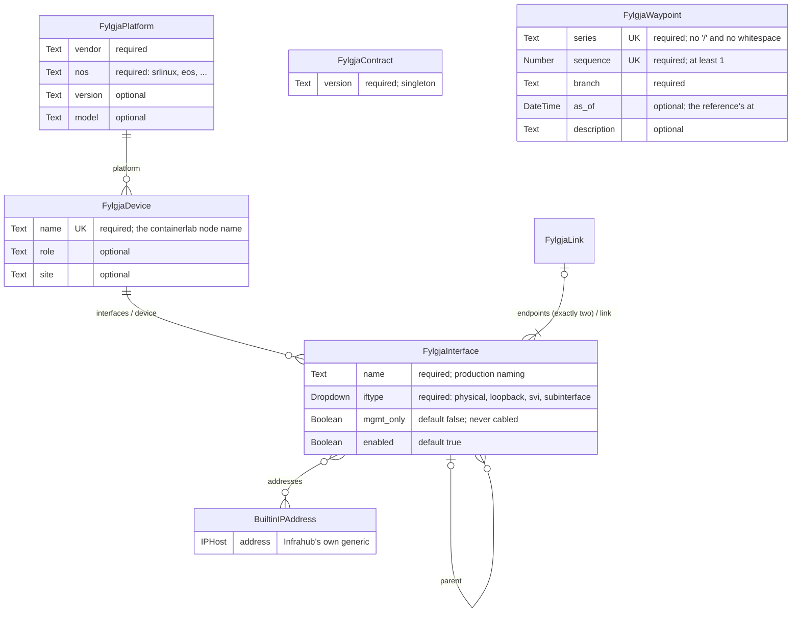

# The schema's entities

Fylgja reads intent only through its generics, `schema/fylgja-generics.yaml`, never through
a concrete kind. The diagram shows each generic with every attribute it declares, each of
which the read queries, typed by its Infrahub kind, and the relationships between them with
their cardinalities; beside them stand Fylgja's two concrete kinds, the contract singleton
and the waypoint (`schema/fylgja-waypoint.yaml`), and Infrahub's own address generic, which
an interface's `addresses` point at. Names are as the YAML spells them.

The reference schema, `schema/reference.yaml`, implements the four generics with four
concrete kinds for an install with no model of its own: `NetworkPlatform`,
`NetworkDevice`, `NetworkInterface` and `NetworkLink`. `NetworkDevice` also inherits
Infrahub's `CoreArtifactTarget`, which contract `0.2` demands of every kind implementing
`FylgjaDevice`, so that Infrahub can render the device's configuration artifact and the
read can find it. An organisation with a model of its own adds `inherit_from` to its own
kinds instead. Nobody implements `FylgjaContract` or `FylgjaWaypoint`: the contract holds
the version the read checks first, and a waypoint, branch-agnostic and loaded on the
default branch, names a pinned reference by its series and sequence.

