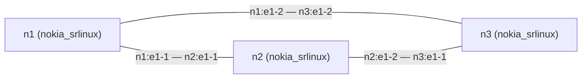
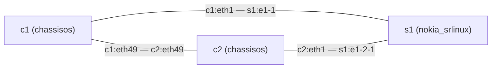
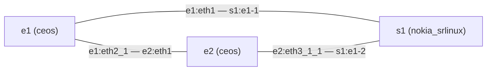

# The fixture topologies

Generated by `scripts/diagrams.sh` from each golden bundle under `testdata/golden/`:
its `topology.clab.yml` and its `bundle_id`. Regenerate it with `make diagrams`;
never edit it by hand. Each node is labelled with its containerlab kind, and each link
with its two endpoints as the topology names them.

## three-node — `23f86a2678a49a324a04ae458703be8252e2e30d6712d6b6094ce1ccd5c2988e`

## lossy — `5773b6bba1107076b2cde8283f92494d42b3eab89c5f297ea25f81134fd529f7`

## mixed — `391bcb96c39e7e878fa6ba78ac869742b04f517fa914e2fce51c3ea4944dd3cb`

